# ldf-bible-reading

<!-- Auto Generated Below -->

## Properties

| Property   | Attribute  | Description                                            | Type                     | Default     |
| ---------- | ---------- | ------------------------------------------------------ | ------------------------ | ----------- |
| `doc`      | `doc`      | An LDF BibleReading object.                            | `BibleReading \| string` | `undefined` |
| `editable` | `editable` | Whether the object is editable                         | `boolean`                | `undefined` |
| `path`     | `path`     | A JSON Pointer that points to the Collect being edited | `string`                 | `undefined` |

## Events

| Event                | Description | Type                  |
| -------------------- | ----------- | --------------------- |
| `ldfDocShouldChange` |             | `CustomEvent<Change>` |

## Dependencies

### Used by

 - [ldf-liturgical-document](../liturgical-document)

### Depends on

- [ldf-label-bar](../label-bar)
- ion-buttons
- ion-button
- ion-icon
- ion-label
- [ldf-heading](../heading)
- [ldf-editable-text](../editable-text)
- [ldf-liturgical-document](../liturgical-document)
- [ldf-string](../string)

### Graph

```mermaid
graph TD;
  ldf-bible-reading --> ldf-label-bar
  ldf-bible-reading --> ion-buttons
  ldf-bible-reading --> ion-button
  ldf-bible-reading --> ion-icon
  ldf-bible-reading --> ion-label
  ldf-bible-reading --> ldf-heading
  ldf-bible-reading --> ldf-editable-text
  ldf-bible-reading --> ldf-liturgical-document
  ldf-bible-reading --> ldf-string
  ion-button --> ion-ripple-effect
  ldf-heading --> ldf-string
  ldf-heading --> ldf-editable-text
  ldf-heading --> ldf-label-bar
  ldf-heading --> ldf-day-name
  ldf-heading --> ldf-text
  ldf-editable-text --> ion-input
  ldf-text --> ldf-label-bar
  ldf-text --> ldf-heading
  ldf-text --> ldf-editable-text
  ldf-text --> ldf-string
  ldf-liturgical-document --> ldf-bible-reading
  ldf-liturgy --> ldf-liturgical-document
  ldf-liturgy --> ldf-editable-add-block
  ldf-editable-add-block --> ion-button
  ldf-editable-add-block --> ion-icon
  ldf-editable-add-block --> ion-label
  ldf-image --> ldf-label-bar
  ldf-image --> ldf-editable-text
  ldf-meditation --> ion-button
  ldf-meditation --> ion-icon
  ldf-meditation --> ion-label
  ldf-option --> ion-segment
  ldf-option --> ion-segment-button
  ldf-option --> ion-label
  ldf-option --> ion-toolbar
  ldf-option --> ion-select
  ldf-option --> ion-select-option
  ldf-option --> ion-buttons
  ldf-option --> ion-button
  ldf-option --> ion-icon
  ldf-option --> ldf-label-bar
  ldf-option --> ldf-liturgical-document
  ion-segment-button --> ion-ripple-effect
  ldf-refrain --> ldf-label-bar
  ldf-refrain --> ldf-editable-text
  ldf-rubric --> ldf-label-bar
  ldf-rubric --> ldf-editable-text
  ldf-responsive-prayer --> ldf-editable-text
  ldf-responsive-prayer --> ldf-string
  ldf-responsive-prayer --> ldf-label-bar
  ldf-responsive-prayer --> ldf-heading
  ldf-psalm --> ldf-refrain
  ldf-psalm --> ldf-liturgical-document
  ldf-psalm --> ldf-heading
  ldf-psalm --> ldf-label-bar
  ldf-psalm --> ion-buttons
  ldf-psalm --> ion-button
  ldf-psalm --> ion-icon
  ldf-psalm --> ion-label
  ldf-psalm --> ldf-editable-text
  ldf-psalm --> ldf-string
  ldf-editable-metadata-buttons --> ldf-label-bar
  ldf-editable-metadata-buttons --> ion-buttons
  ldf-editable-metadata-buttons --> ion-button
  ldf-editable-metadata-buttons --> ion-label
  ldf-editable-metadata-buttons --> ion-icon
  ldf-editable-metadata-buttons --> ldf-editable-delete
  ldf-editable-delete --> ion-buttons
  ldf-editable-delete --> ion-button
  ldf-editable-delete --> ion-icon
  style ldf-bible-reading fill:#f9f,stroke:#333,stroke-width:4px
```

----------------------------------------------

*Built with [StencilJS](https://stenciljs.com/)*
