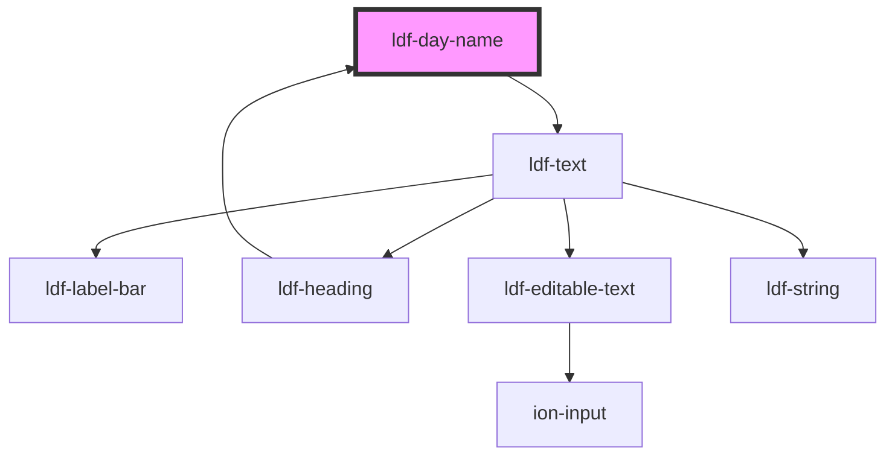

# ldf-day-name

<!-- Auto Generated Below -->

## Properties

| Property | Attribute | Description                     | Type                      | Default     |
| -------- | --------- | ------------------------------- | ------------------------- | ----------- |
| `day`    | `day`     | The day to be rendered as text. | `LiturgicalDay \| string` | `undefined` |

## Dependencies

### Used by

 - [ldf-heading](../heading)

### Depends on

- [ldf-text](../text)

### Graph

----------------------------------------------

*Built with [StencilJS](https://stenciljs.com/)*
