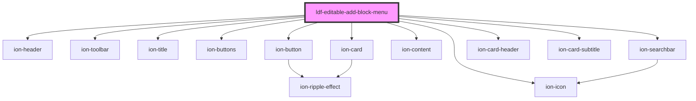

# ldf-editable-add-block-menu

<!-- Auto Generated Below -->

## Properties

| Property | Attribute | Description | Type  | Default     |
| -------- | --------- | ----------- | ----- | ----------- |
| `modal`  | `modal`   |             | `any` | `undefined` |

## Dependencies

### Depends on

- ion-header
- ion-toolbar
- ion-title
- ion-buttons
- ion-button
- ion-icon
- ion-searchbar
- ion-content
- ion-card
- ion-card-header
- ion-card-subtitle

### Graph

----------------------------------------------

*Built with [StencilJS](https://stenciljs.com/)*
