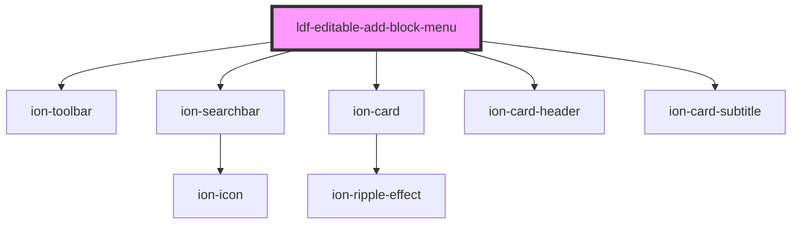

# ldf-editable-add-block-menu

<!-- Auto Generated Below -->

## Events

| Event               | Description | Type                      |
| ------------------- | ----------- | ------------------------- |
| `ldfShouldAddBlock` |             | `CustomEvent<MenuOption>` |

## Dependencies

### Depends on

- ion-toolbar
- ion-searchbar
- ion-card
- ion-card-header
- ion-card-subtitle

### Graph

----------------------------------------------

*Built with [StencilJS](https://stenciljs.com/)*
