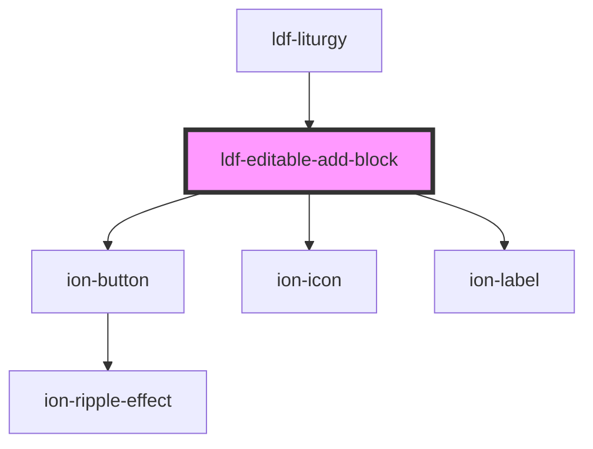

# ldf-editable-add-block

<!-- Auto Generated Below -->

## Properties

| Property  | Attribute | Description                                                                                 | Type      | Default     |
| --------- | --------- | ------------------------------------------------------------------------------------------- | --------- | ----------- |
| `base`    | `base`    | A JSON Pointer that points to the array within which the item to be inserted will be nested | `string`  | `undefined` |
| `index`   | `index`   | The item's index within that array                                                          | `number`  | `undefined` |
| `visible` | `visible` | If `visible` is true, the button should appear.                                             | `boolean` | `undefined` |

## Events

| Event                | Description                                                                                 | Type                                            |
| -------------------- | ------------------------------------------------------------------------------------------- | ----------------------------------------------- |
| `ldfDocShouldAdd`    | Gives a path to the point in the document at which a new LiturgicalDocument should be added | `CustomEvent<{ base: string; index: number; }>` |
| `ldfDocShouldChange` |                                                                                             | `CustomEvent<any>`                              |

## Dependencies

### Used by

 - [ldf-liturgy](../liturgy)

### Depends on

- ion-button
- ion-icon
- ion-label

### Graph

----------------------------------------------

*Built with [StencilJS](https://stenciljs.com/)*
