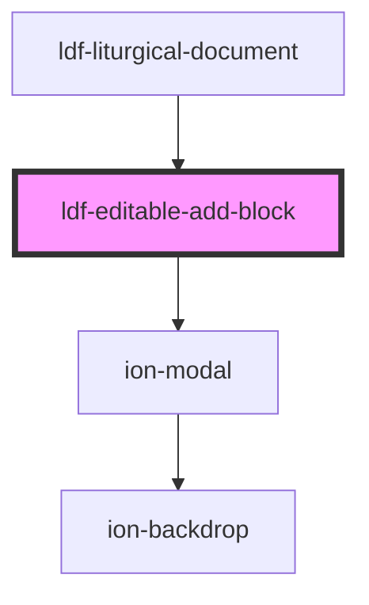

# ldf-editable-add-block

<!-- Auto Generated Below -->

## Properties

| Property  | Attribute | Description                                                       | Type      | Default     |
| --------- | --------- | ----------------------------------------------------------------- | --------- | ----------- |
| `path`    | `path`    | A JSON Pointer that points to the LiturgicalDocument being edited | `string`  | `undefined` |
| `visible` | `visible` | If `visible` is true, the button should appear.                   | `boolean` | `undefined` |

## Events

| Event             | Description | Type                  |
| ----------------- | ----------- | --------------------- |
| `docShouldChange` |             | `CustomEvent<Change>` |

## Dependencies

### Used by

 - [ldf-liturgical-document](../liturgical-document)

### Depends on

- ion-modal

### Graph

----------------------------------------------

*Built with [StencilJS](https://stenciljs.com/)*
