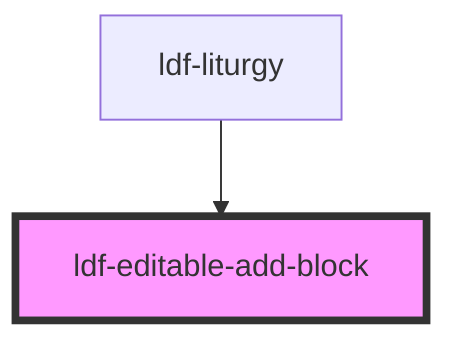

# ldf-editable-add-block

<!-- Auto Generated Below -->

## Properties

| Property  | Attribute | Description                                                                                 | Type      | Default     |
| --------- | --------- | ------------------------------------------------------------------------------------------- | --------- | ----------- |
| `base`    | `base`    | A JSON Pointer that points to the array within which the item to be inserted will be nested | `string`  | `undefined` |
| `index`   | `index`   | The item's index within that array                                                          | `number`  | `undefined` |
| `visible` | `visible` | If `visible` is true, the button should appear.                                             | `boolean` | `undefined` |

## Events

| Event                | Description | Type                  |
| -------------------- | ----------- | --------------------- |
| `ldfDocShouldChange` |             | `CustomEvent<Change>` |

## Dependencies

### Used by

 - [ldf-liturgy](../liturgy)

### Graph

----------------------------------------------

*Built with [StencilJS](https://stenciljs.com/)*
