# ldf-editable-antiphon-field

<!-- Auto Generated Below -->

## Properties

| Property          | Attribute         | Description                                             | Type                                                       | Default     |
| ----------------- | ----------------- | ------------------------------------------------------- | ---------------------------------------------------------- | ----------- |
| `antiphon`        | `antiphon`        | Starting value for editing                              | `Refrain \| string \| { [x: string]: string \| Refrain; }` | `undefined` |
| `insert_antiphon` | `insert_antiphon` |                                                         | `boolean`                                                  | `undefined` |
| `omit_antiphon`   | `omit_antiphon`   |                                                         | `boolean`                                                  | `undefined` |
| `path`            | `path`            | A JSON Pointer that points to the document being edited | `string`                                                   | `undefined` |

## Events

| Event                | Description | Type                  |
| -------------------- | ----------- | --------------------- |
| `ldfDocShouldChange` |             | `CustomEvent<Change>` |

## Dependencies

### Used by

 - [ldf-editable-metadata-metadata-fields](../editable-metadata-metadata-fields)

### Depends on

- ion-radio-group
- ion-list-header
- ion-label
- ion-item
- ion-radio
- ion-grid
- ion-row
- ion-col
- ion-toolbar
- ion-buttons
- ion-button
- ion-icon
- [ldf-editable-text](../editable-text)
- [ldf-liturgical-document](../liturgical-document)

### Graph

```mermaid
graph TD;
  ldf-editable-antiphon-field --> ion-radio-group
  ldf-editable-antiphon-field --> ion-list-header
  ldf-editable-antiphon-field --> ion-label
  ldf-editable-antiphon-field --> ion-item
  ldf-editable-antiphon-field --> ion-radio
  ldf-editable-antiphon-field --> ion-grid
  ldf-editable-antiphon-field --> ion-row
  ldf-editable-antiphon-field --> ion-col
  ldf-editable-antiphon-field --> ion-toolbar
  ldf-editable-antiphon-field --> ion-buttons
  ldf-editable-antiphon-field --> ion-button
  ldf-editable-antiphon-field --> ion-icon
  ldf-editable-antiphon-field --> ldf-editable-text
  ldf-editable-antiphon-field --> ldf-liturgical-document
  ion-item --> ion-icon
  ion-item --> ion-ripple-effect
  ion-button --> ion-ripple-effect
  ldf-editable-text --> ion-input
  ldf-liturgical-document --> ion-skeleton-text
  ldf-liturgical-document --> ldf-liturgy
  ldf-liturgical-document --> ldf-heading
  ldf-liturgical-document --> ldf-image
  ldf-liturgical-document --> ldf-meditation
  ldf-liturgical-document --> ldf-option
  ldf-liturgical-document --> ldf-refrain
  ldf-liturgical-document --> ldf-rubric
  ldf-liturgical-document --> ldf-text
  ldf-liturgical-document --> ldf-responsive-prayer
  ldf-liturgical-document --> ldf-bible-reading
  ldf-liturgical-document --> ldf-psalm
  ldf-liturgical-document --> ldf-editable-metadata-buttons
  ldf-liturgy --> ldf-liturgical-document
  ldf-liturgy --> ldf-editable-add-block
  ldf-editable-add-block --> ion-button
  ldf-editable-add-block --> ion-icon
  ldf-editable-add-block --> ion-label
  ldf-heading --> ldf-string
  ldf-heading --> ldf-editable-text
  ldf-heading --> ldf-label-bar
  ldf-heading --> ldf-day-name
  ldf-image --> ldf-label-bar
  ldf-image --> ldf-editable-text
  ldf-meditation --> ion-button
  ldf-meditation --> ion-icon
  ldf-meditation --> ion-label
  ldf-meditation --> ldf-label-bar
  ldf-option --> ion-segment
  ldf-option --> ion-segment-button
  ldf-option --> ion-label
  ldf-option --> ion-toolbar
  ldf-option --> ion-select
  ldf-option --> ion-select-option
  ldf-option --> ion-buttons
  ldf-option --> ion-button
  ldf-option --> ion-icon
  ldf-option --> ldf-label-bar
  ldf-option --> ldf-liturgical-document
  ion-segment-button --> ion-ripple-effect
  ldf-refrain --> ldf-label-bar
  ldf-refrain --> ldf-editable-text
  ldf-rubric --> ldf-label-bar
  ldf-rubric --> ldf-editable-text
  ldf-text --> ldf-label-bar
  ldf-text --> ldf-heading
  ldf-text --> ldf-editable-text
  ldf-text --> ldf-string
  ldf-responsive-prayer --> ldf-editable-text
  ldf-responsive-prayer --> ldf-string
  ldf-responsive-prayer --> ldf-label-bar
  ldf-responsive-prayer --> ldf-heading
  ldf-bible-reading --> ldf-label-bar
  ldf-bible-reading --> ldf-heading
  ldf-bible-reading --> ldf-editable-text
  ldf-bible-reading --> ldf-liturgical-document
  ldf-bible-reading --> ldf-string
  ldf-psalm --> ldf-refrain
  ldf-psalm --> ldf-liturgical-document
  ldf-psalm --> ldf-heading
  ldf-psalm --> ldf-label-bar
  ldf-psalm --> ldf-editable-text
  ldf-psalm --> ldf-string
  ldf-editable-metadata-buttons --> ldf-label-bar
  ldf-editable-metadata-buttons --> ion-buttons
  ldf-editable-metadata-buttons --> ion-button
  ldf-editable-metadata-buttons --> ion-icon
  ldf-editable-metadata-buttons --> ldf-editable-delete
  ldf-editable-delete --> ion-buttons
  ldf-editable-delete --> ion-button
  ldf-editable-delete --> ion-icon
  ldf-editable-metadata-metadata-fields --> ldf-editable-antiphon-field
  style ldf-editable-antiphon-field fill:#f9f,stroke:#333,stroke-width:4px
```

----------------------------------------------

*Built with [StencilJS](https://stenciljs.com/)*
