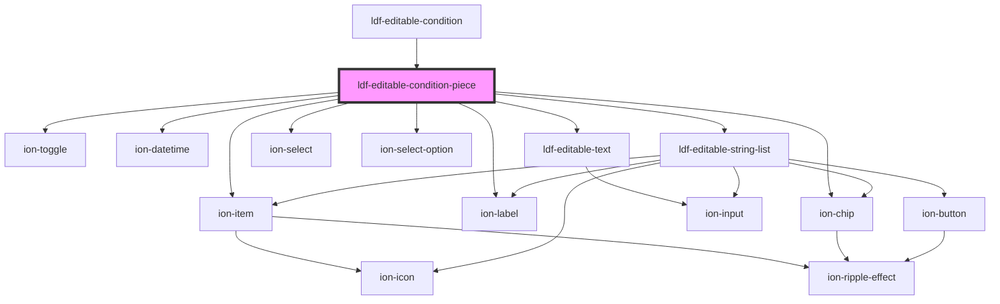

# ldf-editable-condition-piece

<!-- Auto Generated Below -->

## Properties

| Property    | Attribute   | Description                                           | Type     | Default     |
| ----------- | ----------- | ----------------------------------------------------- | -------- | ----------- |
| `condition` | `condition` | Starting value for editing                            | `any`    | `undefined` |
| `path`      | `path`      | A JSON Pointer that points to the object being edited | `string` | `undefined` |

## Events

| Event                | Description | Type               |
| -------------------- | ----------- | ------------------ |
| `ldfDocShouldChange` |             | `CustomEvent<any>` |

## Dependencies

### Used by

 - [ldf-editable-condition](../editable-condition)

### Depends on

- ion-item
- ion-label
- ion-toggle
- ion-datetime
- [ldf-editable-text](../editable-text)
- ion-select
- ion-select-option
- ion-chip
- [ldf-editable-string-list](../editable-string-list)

### Graph

----------------------------------------------

*Built with [StencilJS](https://stenciljs.com/)*
