# ldf-editable-condition

<!-- Auto Generated Below -->

## Properties

| Property | Attribute | Description                                           | Type                 | Default     |
| -------- | --------- | ----------------------------------------------------- | -------------------- | ----------- |
| `modal`  | `modal`   | Used to pass in the `IonModal` we will dismiss        | `any`                | `undefined` |
| `obj`    | --        | Starting value for editing                            | `LiturgicalDocument` | `undefined` |
| `path`   | `path`    | A JSON Pointer that points to the object being edited | `string`             | `undefined` |

## Events

| Event                | Description | Type                  |
| -------------------- | ----------- | --------------------- |
| `ldfDocShouldChange` |             | `CustomEvent<Change>` |

## Dependencies

### Depends on

- ion-header
- ion-toolbar
- ion-title
- ion-buttons
- ion-button
- ion-icon
- ion-content
- ion-list
- ion-item
- ion-label
- ion-checkbox
- ion-radio-group
- ion-radio
- [ldf-editable-delete](../editable-delete)
- [ldf-editable-condition-piece](../editable-condition-piece)

### Graph

```mermaid
graph TD;
  ldf-editable-condition --> ion-header
  ldf-editable-condition --> ion-toolbar
  ldf-editable-condition --> ion-title
  ldf-editable-condition --> ion-buttons
  ldf-editable-condition --> ion-button
  ldf-editable-condition --> ion-icon
  ldf-editable-condition --> ion-content
  ldf-editable-condition --> ion-list
  ldf-editable-condition --> ion-item
  ldf-editable-condition --> ion-label
  ldf-editable-condition --> ion-checkbox
  ldf-editable-condition --> ion-radio-group
  ldf-editable-condition --> ion-radio
  ldf-editable-condition --> ldf-editable-delete
  ldf-editable-condition --> ldf-editable-condition-piece
  ion-button --> ion-ripple-effect
  ion-item --> ion-icon
  ion-item --> ion-ripple-effect
  ion-item --> ion-note
  ldf-editable-delete --> ion-buttons
  ldf-editable-delete --> ion-button
  ldf-editable-delete --> ion-icon
  ldf-editable-condition-piece --> ion-item
  ldf-editable-condition-piece --> ion-label
  ldf-editable-condition-piece --> ion-toggle
  ldf-editable-condition-piece --> ion-datetime
  ldf-editable-condition-piece --> ldf-editable-text
  ldf-editable-condition-piece --> ion-select
  ldf-editable-condition-piece --> ion-select-option
  ldf-editable-condition-piece --> ion-chip
  ldf-editable-condition-piece --> ldf-editable-string-list
  ion-toggle --> ion-icon
  ion-datetime --> ion-buttons
  ion-datetime --> ion-button
  ion-datetime --> ion-picker-internal
  ion-datetime --> ion-picker-column-internal
  ion-datetime --> ion-item
  ion-datetime --> ion-label
  ion-datetime --> ion-icon
  ion-datetime --> ion-popover
  ion-popover --> ion-backdrop
  ldf-editable-text --> ion-input
  ion-select --> ion-select-popover
  ion-select --> ion-popover
  ion-select --> ion-action-sheet
  ion-select --> ion-alert
  ion-select-popover --> ion-item
  ion-select-popover --> ion-checkbox
  ion-select-popover --> ion-label
  ion-select-popover --> ion-radio-group
  ion-select-popover --> ion-radio
  ion-select-popover --> ion-list
  ion-select-popover --> ion-list-header
  ion-action-sheet --> ion-backdrop
  ion-action-sheet --> ion-icon
  ion-action-sheet --> ion-ripple-effect
  ion-alert --> ion-ripple-effect
  ion-alert --> ion-backdrop
  ion-chip --> ion-ripple-effect
  ldf-editable-string-list --> ion-item
  ldf-editable-string-list --> ion-label
  ldf-editable-string-list --> ion-chip
  ldf-editable-string-list --> ion-icon
  ldf-editable-string-list --> ion-input
  ldf-editable-string-list --> ion-button
  style ldf-editable-condition fill:#f9f,stroke:#333,stroke-width:4px
```

----------------------------------------------

*Built with [StencilJS](https://stenciljs.com/)*
