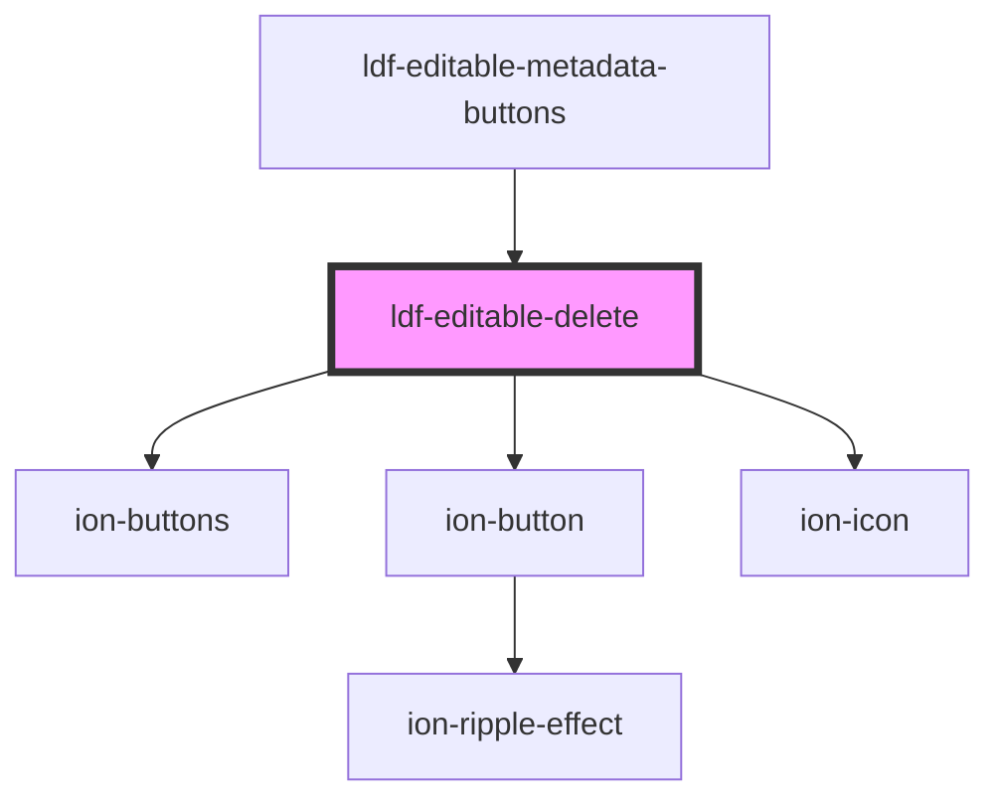

# ldf-editable-delete

<!-- Auto Generated Below -->

## Properties

| Property | Attribute | Description                                                             | Type                 | Default     |
| -------- | --------- | ----------------------------------------------------------------------- | -------------------- | ----------- |
| `base`   | `base`    | A JSON Pointer that points to the array within which the item is nested | `string`             | `undefined` |
| `index`  | `index`   | The item's index within that array                                      | `number`             | `undefined` |
| `obj`    | --        | The LiturgicalDocument itself                                           | `LiturgicalDocument` | `undefined` |

## Events

| Event                | Description | Type                  |
| -------------------- | ----------- | --------------------- |
| `ldfDocShouldChange` |             | `CustomEvent<Change>` |

## Dependencies

### Used by

 - [ldf-editable-metadata-buttons](../editable-metadata-buttons)

### Depends on

- ion-buttons
- ion-button
- ion-icon

### Graph

----------------------------------------------

*Built with [StencilJS](https://stenciljs.com/)*
