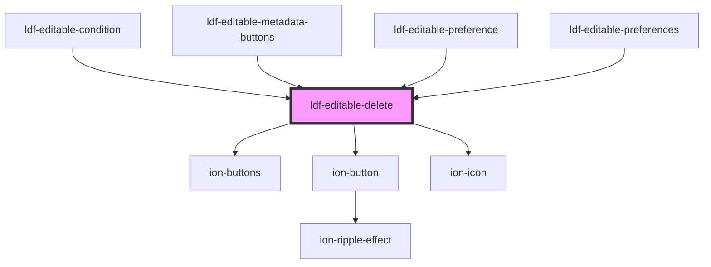

# ldf-editable-delete

<!-- Auto Generated Below -->

## Properties

| Property | Attribute | Description                                                                       | Type                  | Default     |
| -------- | --------- | --------------------------------------------------------------------------------- | --------------------- | ----------- |
| `base`   | `base`    | A JSON Pointer that points to the array or object within which the item is nested | `string`              | `undefined` |
| `index`  | `index`   | The item's index within that array, or property within that object                | `number \| string`    | `undefined` |
| `obj`    | `obj`     | The item to be deleted                                                            | `any`                 | `undefined` |
| `type`   | `type`    |                                                                                   | `"array" \| "object"` | `'array'`   |

## Events

| Event                | Description | Type                  |
| -------------------- | ----------- | --------------------- |
| `ldfDocShouldChange` |             | `CustomEvent<Change>` |

## Dependencies

### Used by

 - [ldf-editable-condition](../editable-condition)
 - [ldf-editable-metadata-buttons](../editable-metadata-buttons)
 - [ldf-editable-preference](../editable-preference)
 - [ldf-editable-preferences](../editable-preferences)

### Depends on

- ion-buttons
- ion-button
- ion-icon

### Graph

----------------------------------------------

*Built with [StencilJS](https://stenciljs.com/)*
