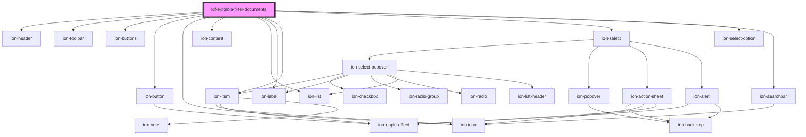

# ldf-editable-filter-documents

<!-- Auto Generated Below -->

## Properties

| Property         | Attribute | Description                                                                | Type                                              | Default     |
| ---------------- | --------- | -------------------------------------------------------------------------- | ------------------------------------------------- | ----------- |
| `changeCallback` | --        |                                                                            | `(doc: LiturgicalDocument) => void`               | `undefined` |
| `modal`          | `modal`   | ion-modal                                                                  | `any`                                             | `undefined` |
| `options`        | --        | Options to search through                                                  | `LiturgicalDocument[]`                            | `[]`        |
| `type`           | `type`    |                                                                            | `"canticle" \| "collect" \| "psalm" \| "reading"` | `undefined` |
| `versions`       | --        | Whether to include a `LiturgicalDocument.version` field with the selection | `{ [x: string]: string; }`                        | `{}`        |

## Events

| Event                 | Description | Type                              |
| --------------------- | ----------- | --------------------------------- |
| `ldfDocumentSelected` |             | `CustomEvent<LiturgicalDocument>` |

## Methods

### `setOptions(options: LiturgicalDocument[]) => Promise<void>`

Set the list of liturgy versions

#### Returns

Type: `Promise<void>`

### `setVersion(version: string) => Promise<void>`

Sets the selected version.

#### Returns

Type: `Promise<void>`

### `setVersions(versions: Record<string, string>) => Promise<void>`

Set the list of liturgy versions

#### Returns

Type: `Promise<void>`

## Dependencies

### Depends on

- ion-header
- ion-toolbar
- ion-buttons
- ion-button
- ion-icon
- ion-content
- ion-list
- ion-label
- ion-item
- ion-select
- ion-select-option
- ion-searchbar

### Graph

----------------------------------------------

*Built with [StencilJS](https://stenciljs.com/)*
