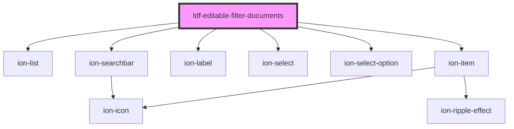

# ldf-editable-filter-documents

<!-- Auto Generated Below -->

## Properties

| Property   | Attribute | Description                                                                | Type                                | Default     |
| ---------- | --------- | -------------------------------------------------------------------------- | ----------------------------------- | ----------- |
| `options`  | --        | Options to search through                                                  | `LiturgicalDocument[]`              | `[]`        |
| `type`     | `type`    |                                                                            | `"collect" \| "psalm" \| "reading"` | `undefined` |
| `versions` | --        | Whether to include a `LiturgicalDocument.version` field with the selection | `string[]`                          | `undefined` |

## Events

| Event                 | Description | Type                              |
| --------------------- | ----------- | --------------------------------- |
| `ldfDocumentSelected` |             | `CustomEvent<LiturgicalDocument>` |

## Dependencies

### Depends on

- ion-list
- ion-item
- ion-label
- ion-select
- ion-select-option
- ion-searchbar

### Graph

----------------------------------------------

*Built with [StencilJS](https://stenciljs.com/)*
