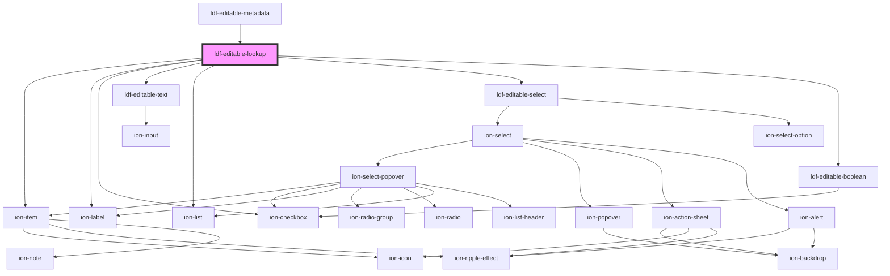

# ldf-editable-lookup

<!-- Auto Generated Below -->

## Properties

| Property | Attribute | Description                                           | Type                                                                                                                                                                                                                        | Default     |
| -------- | --------- | ----------------------------------------------------- | --------------------------------------------------------------------------------------------------------------------------------------------------------------------------------------------------------------------------- | ----------- |
| `lookup` | --        | Starting value for editing                            | `{ type: string; table?: string \| { preference: string; }; item?: string \| number \| { preference: string; }; filter?: "seasonal" \| "evening" \| "day"; rotate?: boolean; random?: boolean; allow_multiple?: boolean; }` | `undefined` |
| `path`   | `path`    | A JSON Pointer that points to the object being edited | `string`                                                                                                                                                                                                                    | `undefined` |
| `types`  | --        | Available lookup types                                | `readonly string[]`                                                                                                                                                                                                         | `undefined` |

## Events

| Event                | Description | Type                  |
| -------------------- | ----------- | --------------------- |
| `ldfDocShouldChange` |             | `CustomEvent<Change>` |

## Dependencies

### Used by

 - [ldf-editable-metadata](../editable-metadata)

### Depends on

- ion-item
- ion-label
- ion-checkbox
- [ldf-editable-text](../editable-text)
- ion-list
- [ldf-editable-select](../editable-select)
- [ldf-editable-boolean](../editable-boolean)

### Graph

----------------------------------------------

*Built with [StencilJS](https://stenciljs.com/)*
