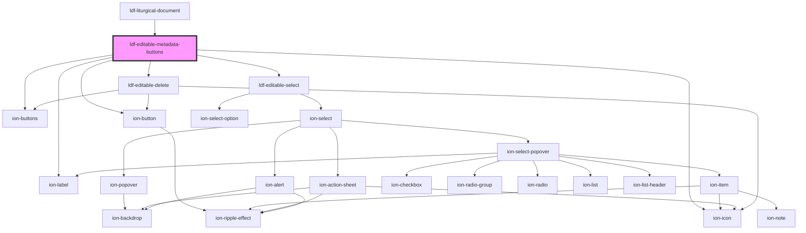

# ldf-editable-metadata-buttons

<!-- Auto Generated Below -->

## Properties

| Property     | Attribute     | Description                                                                                                          | Type                                                                                                                                             | Default     |
| ------------ | ------------- | -------------------------------------------------------------------------------------------------------------------- | ------------------------------------------------------------------------------------------------------------------------------------------------ | ----------- |
| `base`       | `base`        | A JSON Pointer that points to the array within which the item is nested                                              | `string`                                                                                                                                         | `undefined` |
| `index`      | `index`       | The item's index within that array                                                                                   | `number`                                                                                                                                         | `undefined` |
| `obj`        | --            | The LiturgicalDocument itself                                                                                        | `LiturgicalDocument`                                                                                                                             | `undefined` |
| `parentType` | `parent-type` | Type of the parent `LiturgicalDocument`, if any                                                                      | `"bible-reading" \| "cycle" \| "heading" \| "liturgy" \| "meditation" \| "option" \| "psalm" \| "refrain" \| "responsive" \| "rubric" \| "text"` | `undefined` |
| `preview`    | `preview`     | Documents in `preview` mode will display as if they're not editable, unless the user explicitly chooses to edit them | `boolean`                                                                                                                                        | `false`     |
| `visible`    | `visible`     | Whether to show the buttons                                                                                          | `boolean`                                                                                                                                        | `undefined` |

## Events

| Event                | Description | Type                                                             |
| -------------------- | ----------- | ---------------------------------------------------------------- |
| `ldfAddOptionToDoc`  |             | `CustomEvent<AddOptionToDoc>`                                    |
| `ldfDocShouldChange` |             | `CustomEvent<Change>`                                            |
| `ldfDocShouldMove`   |             | `CustomEvent<{ base: string; oldIndex: number; diff: number; }>` |
| `ldfTogglePreview`   |             | `CustomEvent<boolean>`                                           |

## Dependencies

### Used by

 - [ldf-liturgical-document](../liturgical-document)

### Depends on

- ion-buttons
- ion-button
- ion-label
- ion-icon
- [ldf-editable-select](../editable-select)
- [ldf-editable-delete](../editable-delete)

### Graph

----------------------------------------------

*Built with [StencilJS](https://stenciljs.com/)*
