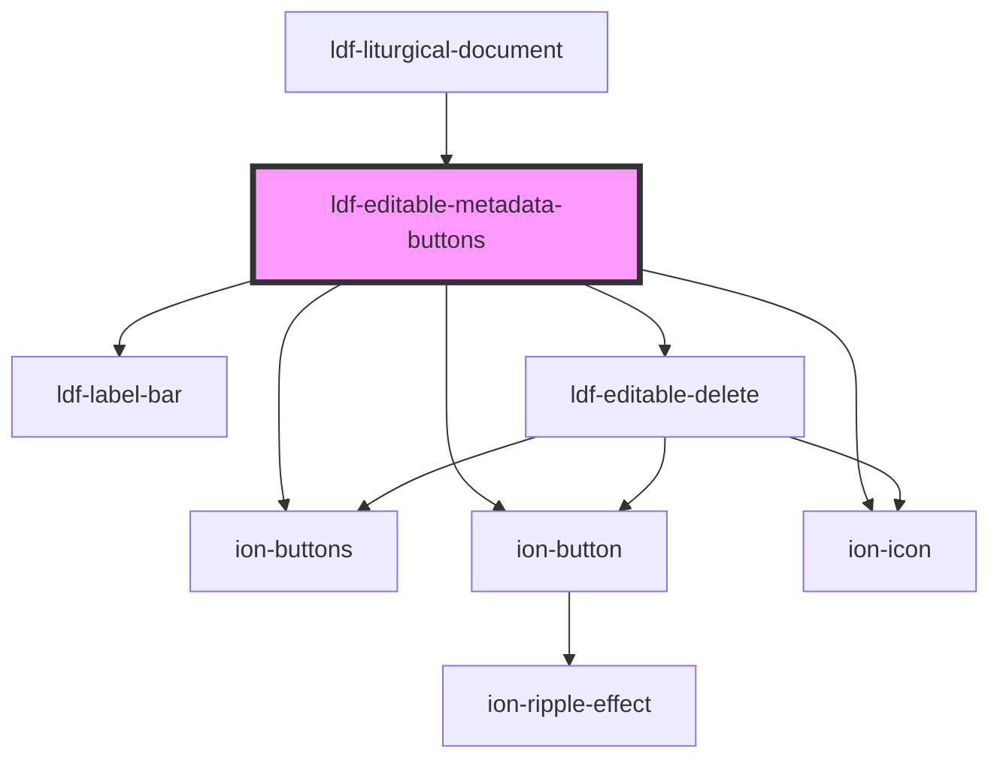

# ldf-editable-metadata-buttons

<!-- Auto Generated Below -->

## Properties

| Property     | Attribute     | Description                                                             | Type                                                                                                                                             | Default     |
| ------------ | ------------- | ----------------------------------------------------------------------- | ------------------------------------------------------------------------------------------------------------------------------------------------ | ----------- |
| `base`       | `base`        | A JSON Pointer that points to the array within which the item is nested | `string`                                                                                                                                         | `undefined` |
| `index`      | `index`       | The item's index within that array                                      | `number`                                                                                                                                         | `undefined` |
| `obj`        | `obj`         | The LiturgicalDocument itself                                           | `any`                                                                                                                                            | `undefined` |
| `parentType` | `parent-type` | Type of the parent `LiturgicalDocument`, if any                         | `"bible-reading" \| "cycle" \| "heading" \| "liturgy" \| "meditation" \| "option" \| "psalm" \| "refrain" \| "responsive" \| "rubric" \| "text"` | `undefined` |
| `visible`    | `visible`     | Whether to show the buttons                                             | `boolean`                                                                                                                                        | `undefined` |

## Events

| Event               | Description | Type                          |
| ------------------- | ----------- | ----------------------------- |
| `ldfAddOptionToDoc` |             | `CustomEvent<AddOptionToDoc>` |

## Dependencies

### Used by

 - [ldf-liturgical-document](../liturgical-document)

### Depends on

- [ldf-label-bar](../label-bar)
- ion-buttons
- ion-button
- ion-icon
- [ldf-editable-delete](../editable-delete)

### Graph

----------------------------------------------

*Built with [StencilJS](https://stenciljs.com/)*
