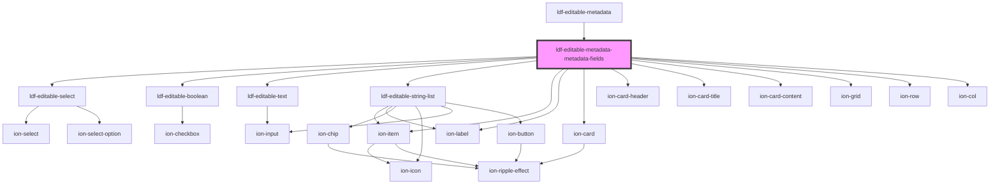

# ldf-editable-metadata-metadata-fields

<!-- Auto Generated Below -->

## Properties

| Property             | Attribute | Description                                  | Type                           | Default       |
| -------------------- | --------- | -------------------------------------------- | ------------------------------ | ------------- |
| `bibleReadingIntros` | --        | Options for introductions to a Bible reading | `LiturgicalDocument[]`         | `new Array()` |
| `doc`                | `doc`     | An LDF LiturgicalDocument object             | `LiturgicalDocument \| string` | `undefined`   |
| `path`               | `path`    | A JSON Pointer that points to the document   | `string`                       | `undefined`   |

## Events

| Event                  | Description | Type                  |
| ---------------------- | ----------- | --------------------- |
| `ldfAskForBibleIntros` |             | `CustomEvent<void>`   |
| `ldfDocShouldChange`   |             | `CustomEvent<Change>` |

## Methods

### `setBibleReadingIntros(intros: string | LiturgicalDocument[]) => Promise<void>`

Set the list of Bible reading introductions

#### Returns

Type: `Promise<void>`

## Dependencies

### Used by

 - [ldf-editable-metadata](../editable-metadata)

### Depends on

- [ldf-editable-select](../editable-select)
- [ldf-editable-boolean](../editable-boolean)
- [ldf-editable-text](../editable-text)
- [ldf-editable-string-list](../editable-string-list)
- ion-item
- ion-label
- ion-card
- ion-card-header
- ion-card-title
- ion-card-content
- ion-grid
- ion-row
- ion-col

### Graph

----------------------------------------------

*Built with [StencilJS](https://stenciljs.com/)*
