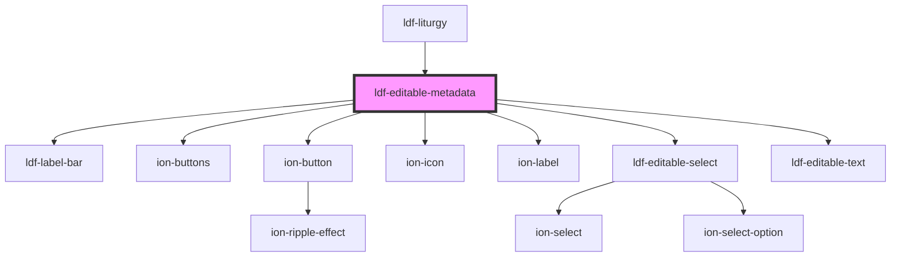

# ldf-editable-metadata

<!-- Auto Generated Below -->

## Properties

| Property  | Attribute | Description                                                       | Type                           | Default     |
| --------- | --------- | ----------------------------------------------------------------- | ------------------------------ | ----------- |
| `doc`     | `doc`     | An LDF LiturgicalDocument object                                  | `LiturgicalDocument \| string` | `undefined` |
| `path`    | `path`    | A JSON Pointer that points to the LiturgicalDocument being edited | `string`                       | `undefined` |
| `visible` | `visible` | If `visible` is true, the controls should appear.                 | `boolean`                      | `undefined` |

## Dependencies

### Used by

 - [ldf-liturgy](../liturgy)

### Depends on

- [ldf-label-bar](../label-bar)
- ion-buttons
- ion-button
- ion-icon
- ion-label
- [ldf-editable-select](../editable-select)
- [ldf-editable-text](../editable-text)

### Graph

----------------------------------------------

*Built with [StencilJS](https://stenciljs.com/)*
