# ldf-editable-metadata

<!-- Auto Generated Below -->

## Properties

| Property    | Attribute   | Description                                                           | Type                           | Default     |
| ----------- | ----------- | --------------------------------------------------------------------- | ------------------------------ | ----------- |
| `collapsed` | `collapsed` | If `collapsed` is false, the full set of editable fields will appear. | `boolean`                      | `undefined` |
| `doc`       | `doc`       | An LDF LiturgicalDocument object                                      | `LiturgicalDocument \| string` | `undefined` |
| `modal`     | `modal`     | Used to pass in the `IonModal` we will dismiss                        | `any`                          | `undefined` |
| `path`      | `path`      | A JSON Pointer that points to the LiturgicalDocument being edited     | `string`                       | `undefined` |
| `visible`   | `visible`   | If `visible` is true, the controls should appear.                     | `boolean`                      | `undefined` |

## Events

| Event                | Description | Type                  |
| -------------------- | ----------- | --------------------- |
| `ldfDocShouldChange` |             | `CustomEvent<Change>` |

## Dependencies

### Depends on

- ion-item
- ion-label
- [ldf-editable-select](../editable-select)
- [ldf-editable-text](../editable-text)
- ion-header
- ion-toolbar
- ion-title
- ion-buttons
- ion-button
- ion-icon
- ion-content
- [ldf-editable-metadata-metadata-fields](../editable-metadata-metadata-fields)
- ion-card
- ion-card-header
- ion-card-title
- ion-card-content
- ion-grid
- ion-row
- ion-col
- [ldf-editable-string-list](../editable-string-list)

### Graph

```mermaid
graph TD;
  ldf-editable-metadata --> ion-item
  ldf-editable-metadata --> ion-label
  ldf-editable-metadata --> ldf-editable-select
  ldf-editable-metadata --> ldf-editable-text
  ldf-editable-metadata --> ion-header
  ldf-editable-metadata --> ion-toolbar
  ldf-editable-metadata --> ion-title
  ldf-editable-metadata --> ion-buttons
  ldf-editable-metadata --> ion-button
  ldf-editable-metadata --> ion-icon
  ldf-editable-metadata --> ion-content
  ldf-editable-metadata --> ldf-editable-metadata-metadata-fields
  ldf-editable-metadata --> ion-card
  ldf-editable-metadata --> ion-card-header
  ldf-editable-metadata --> ion-card-title
  ldf-editable-metadata --> ion-card-content
  ldf-editable-metadata --> ion-grid
  ldf-editable-metadata --> ion-row
  ldf-editable-metadata --> ion-col
  ldf-editable-metadata --> ldf-editable-string-list
  ion-item --> ion-icon
  ion-item --> ion-ripple-effect
  ldf-editable-select --> ion-select
  ldf-editable-select --> ion-select-option
  ldf-editable-text --> ion-input
  ion-button --> ion-ripple-effect
  ldf-editable-metadata-metadata-fields --> ldf-editable-select
  ldf-editable-metadata-metadata-fields --> ldf-editable-boolean
  ldf-editable-metadata-metadata-fields --> ldf-editable-text
  ldf-editable-metadata-metadata-fields --> ldf-editable-string-list
  ldf-editable-metadata-metadata-fields --> ion-item
  ldf-editable-metadata-metadata-fields --> ion-label
  ldf-editable-metadata-metadata-fields --> ion-card
  ldf-editable-metadata-metadata-fields --> ion-card-header
  ldf-editable-metadata-metadata-fields --> ion-card-title
  ldf-editable-metadata-metadata-fields --> ion-card-content
  ldf-editable-metadata-metadata-fields --> ion-grid
  ldf-editable-metadata-metadata-fields --> ion-row
  ldf-editable-metadata-metadata-fields --> ion-col
  ldf-editable-boolean --> ion-checkbox
  ldf-editable-string-list --> ion-item
  ldf-editable-string-list --> ion-label
  ldf-editable-string-list --> ion-chip
  ldf-editable-string-list --> ion-icon
  ldf-editable-string-list --> ion-input
  ldf-editable-string-list --> ion-button
  ion-chip --> ion-ripple-effect
  ion-card --> ion-ripple-effect
  style ldf-editable-metadata fill:#f9f,stroke:#333,stroke-width:4px
```

----------------------------------------------

*Built with [StencilJS](https://stenciljs.com/)*
