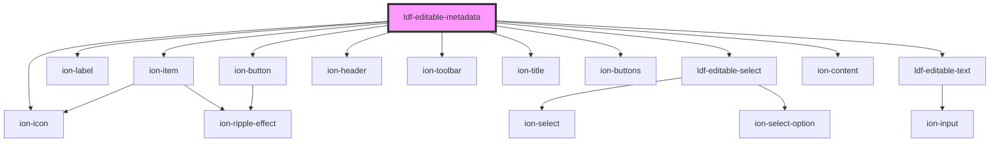

# ldf-editable-metadata

<!-- Auto Generated Below -->

## Properties

| Property    | Attribute   | Description                                                           | Type                           | Default     |
| ----------- | ----------- | --------------------------------------------------------------------- | ------------------------------ | ----------- |
| `collapsed` | `collapsed` | If `collapsed` is false, the full set of editable fields will appear. | `boolean`                      | `undefined` |
| `doc`       | `doc`       | An LDF LiturgicalDocument object                                      | `LiturgicalDocument \| string` | `undefined` |
| `modal`     | `modal`     | Used to pass in the `IonModal` we will dismiss                        | `any`                          | `undefined` |
| `path`      | `path`      | A JSON Pointer that points to the LiturgicalDocument being edited     | `string`                       | `undefined` |
| `visible`   | `visible`   | If `visible` is true, the controls should appear.                     | `boolean`                      | `undefined` |

## Dependencies

### Depends on

- ion-item
- ion-label
- [ldf-editable-select](../editable-select)
- [ldf-editable-text](../editable-text)
- ion-header
- ion-toolbar
- ion-title
- ion-buttons
- ion-button
- ion-icon
- ion-content

### Graph

----------------------------------------------

*Built with [StencilJS](https://stenciljs.com/)*
