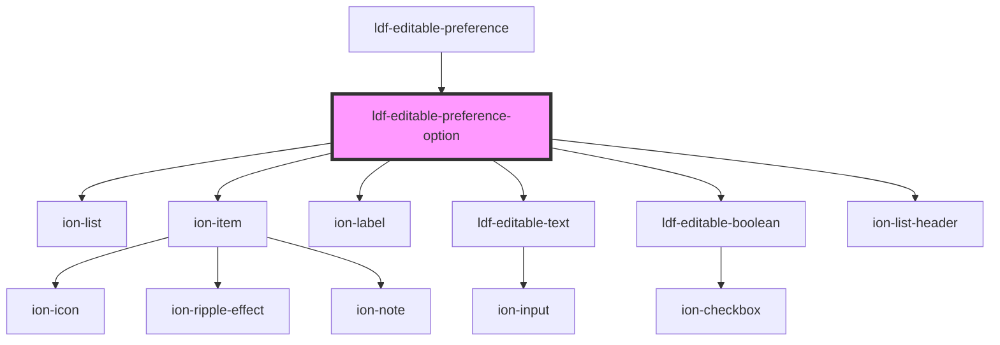

# ldf-editable-preference-option

<!-- Auto Generated Below -->

## Properties

| Property | Attribute | Description                                           | Type               | Default     |
| -------- | --------- | ----------------------------------------------------- | ------------------ | ----------- |
| `option` | --        | Starting value for editing                            | `PreferenceOption` | `undefined` |
| `path`   | `path`    | A JSON Pointer that points to the object being edited | `string`           | `undefined` |

## Events

| Event                | Description | Type                  |
| -------------------- | ----------- | --------------------- |
| `ldfDocShouldChange` |             | `CustomEvent<Change>` |

## Dependencies

### Used by

 - [ldf-editable-preference](../editable-preference)

### Depends on

- ion-list
- ion-item
- ion-label
- [ldf-editable-text](../editable-text)
- [ldf-editable-boolean](../editable-boolean)
- ion-list-header

### Graph

----------------------------------------------

*Built with [StencilJS](https://stenciljs.com/)*
