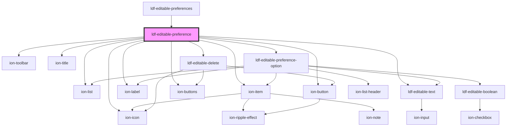

# ldf-editable-preference

<!-- Auto Generated Below -->

## Properties

| Property     | Attribute | Description                                           | Type         | Default     |
| ------------ | --------- | ----------------------------------------------------- | ------------ | ----------- |
| `modal`      | `modal`   | Used to pass in the `IonModal` we will dismiss        | `any`        | `undefined` |
| `path`       | `path`    | A JSON Pointer that points to the object being edited | `string`     | `undefined` |
| `preference` | --        | Starting value for editing                            | `Preference` | `undefined` |

## Events

| Event                | Description | Type                  |
| -------------------- | ----------- | --------------------- |
| `ldfDocShouldChange` |             | `CustomEvent<Change>` |

## Dependencies

### Used by

 - [ldf-editable-preferences](../editable-preferences)

### Depends on

- ion-list
- ion-item
- ion-label
- [ldf-editable-text](../editable-text)
- ion-toolbar
- ion-title
- ion-buttons
- [ldf-editable-delete](../editable-delete)
- [ldf-editable-preference-option](../editable-preference-option)
- ion-button
- ion-icon

### Graph

----------------------------------------------

*Built with [StencilJS](https://stenciljs.com/)*
