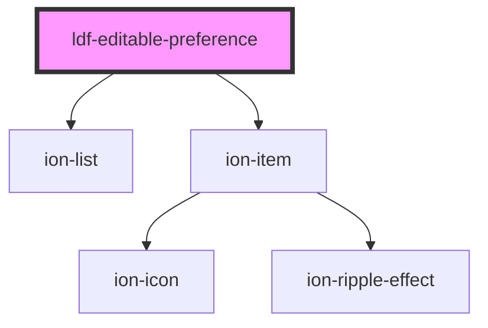

# ldf-editable-preference

<!-- Auto Generated Below -->

## Properties

| Property      | Attribute | Description                                           | Type                           | Default     |
| ------------- | --------- | ----------------------------------------------------- | ------------------------------ | ----------- |
| `path`        | `path`    | A JSON Pointer that points to the object being edited | `string`                       | `undefined` |
| `preferences` | --        | Starting value for editing                            | `{ [x: string]: Preference; }` | `undefined` |

## Events

| Event                | Description | Type                  |
| -------------------- | ----------- | --------------------- |
| `ldfDocShouldChange` |             | `CustomEvent<Change>` |

## Dependencies

### Depends on

- ion-list
- ion-item

### Graph

----------------------------------------------

*Built with [StencilJS](https://stenciljs.com/)*
