# ldf-editable-preference

<!-- Auto Generated Below -->

## Properties

| Property | Attribute | Description                                           | Type                 | Default     |
| -------- | --------- | ----------------------------------------------------- | -------------------- | ----------- |
| `modal`  | `modal`   | Used to pass in the `IonModal` we will dismiss        | `any`                | `undefined` |
| `obj`    | --        | Starting value for editing                            | `LiturgicalDocument` | `undefined` |
| `path`   | `path`    | A JSON Pointer that points to the object being edited | `string`             | `undefined` |

## Events

| Event                | Description | Type                  |
| -------------------- | ----------- | --------------------- |
| `ldfDocShouldChange` |             | `CustomEvent<Change>` |

## Dependencies

### Depends on

- ion-header
- ion-toolbar
- ion-title
- ion-buttons
- ion-button
- ion-icon
- ion-content
- ion-card
- ion-card-header
- ion-card-title
- ion-card-subtitle
- ion-list
- ion-list-header
- [ldf-editable-delete](../editable-delete)
- ion-item
- [ldf-editable-preference](../editable-preference)

### Graph

```mermaid
graph TD;
  ldf-editable-preferences --> ion-header
  ldf-editable-preferences --> ion-toolbar
  ldf-editable-preferences --> ion-title
  ldf-editable-preferences --> ion-buttons
  ldf-editable-preferences --> ion-button
  ldf-editable-preferences --> ion-icon
  ldf-editable-preferences --> ion-content
  ldf-editable-preferences --> ion-card
  ldf-editable-preferences --> ion-card-header
  ldf-editable-preferences --> ion-card-title
  ldf-editable-preferences --> ion-card-subtitle
  ldf-editable-preferences --> ion-list
  ldf-editable-preferences --> ion-list-header
  ldf-editable-preferences --> ldf-editable-delete
  ldf-editable-preferences --> ion-item
  ldf-editable-preferences --> ldf-editable-preference
  ion-button --> ion-ripple-effect
  ion-card --> ion-ripple-effect
  ldf-editable-delete --> ion-buttons
  ldf-editable-delete --> ion-button
  ldf-editable-delete --> ion-icon
  ion-item --> ion-icon
  ion-item --> ion-ripple-effect
  ion-item --> ion-note
  ldf-editable-preference --> ion-list
  ldf-editable-preference --> ion-item
  ldf-editable-preference --> ion-label
  ldf-editable-preference --> ldf-editable-text
  ldf-editable-preference --> ion-toolbar
  ldf-editable-preference --> ion-title
  ldf-editable-preference --> ion-buttons
  ldf-editable-preference --> ldf-editable-delete
  ldf-editable-preference --> ldf-editable-preference-option
  ldf-editable-preference --> ion-button
  ldf-editable-preference --> ion-icon
  ldf-editable-text --> ion-input
  ldf-editable-preference-option --> ion-list
  ldf-editable-preference-option --> ion-item
  ldf-editable-preference-option --> ion-label
  ldf-editable-preference-option --> ldf-editable-text
  ldf-editable-preference-option --> ldf-editable-boolean
  ldf-editable-preference-option --> ion-list-header
  ldf-editable-boolean --> ion-checkbox
  style ldf-editable-preferences fill:#f9f,stroke:#333,stroke-width:4px
```

----------------------------------------------

*Built with [StencilJS](https://stenciljs.com/)*
