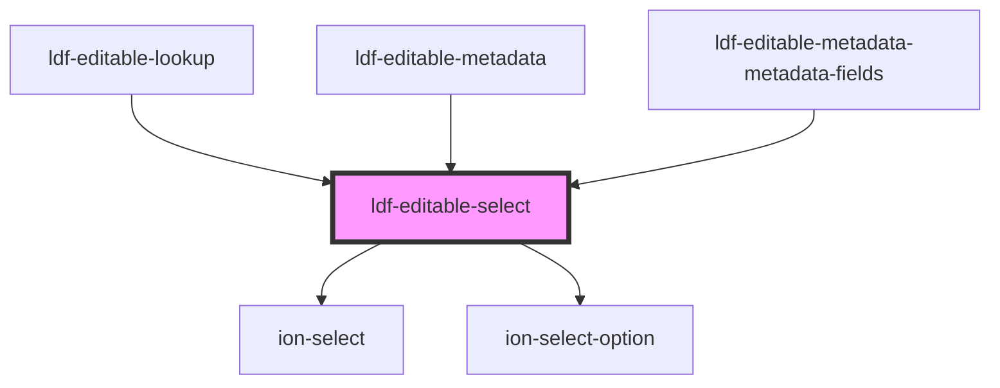

# ldf-editable-select

<!-- Auto Generated Below -->

## Properties

| Property   | Attribute  | Description                                                 | Type                               | Default     |
| ---------- | ---------- | ----------------------------------------------------------- | ---------------------------------- | ----------- |
| `options`  | --         | Options to include in the list                              | `{ value: any; label: string; }[]` | `undefined` |
| `path`     | `path`     | A JSON Pointer that points to the object being edited       | `string`                           | `undefined` |
| `property` | `property` | Property name to edit within the object specified by `path` | `string`                           | `undefined` |
| `value`    | `value`    | Starting value for editing                                  | `any`                              | `undefined` |

## Events

| Event                | Description                              | Type               |
| -------------------- | ---------------------------------------- | ------------------ |
| `ldfChange`          | Optional callback when it emits a change | `CustomEvent<any>` |
| `ldfDocShouldChange` |                                          | `CustomEvent<any>` |

## Dependencies

### Used by

 - [ldf-editable-lookup](../editable-lookup)
 - [ldf-editable-metadata](../editable-metadata)
 - [ldf-editable-metadata-metadata-fields](../editable-metadata-metadata-fields)

### Depends on

- ion-select
- ion-select-option

### Graph

----------------------------------------------

*Built with [StencilJS](https://stenciljs.com/)*
