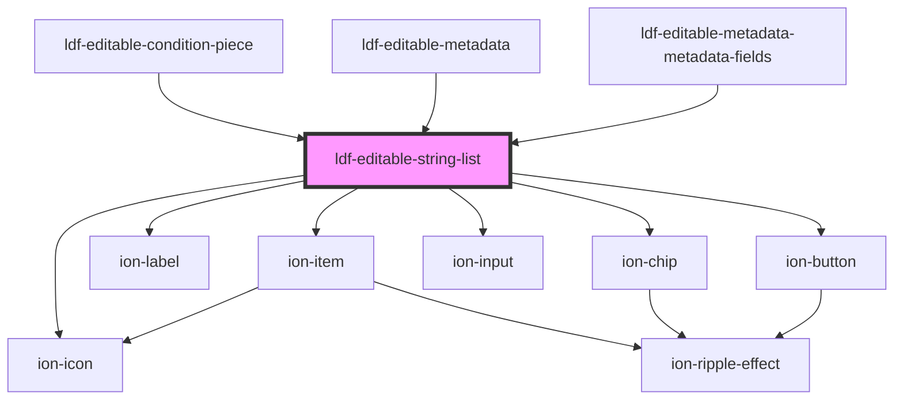

# ldf-editable-string-list

<!-- Auto Generated Below -->

## Properties

| Property   | Attribute  | Description                                      | Type       | Default       |
| ---------- | ---------- | ------------------------------------------------ | ---------- | ------------- |
| `path`     | `path`     | A JSON Pointer that points to the document       | `string`   | `undefined`   |
| `property` | `property` | The property in that document that we're editing | `string`   | `undefined`   |
| `value`    | --         | Initial categories                               | `string[]` | `new Array()` |

## Events

| Event                | Description | Type                  |
| -------------------- | ----------- | --------------------- |
| `ldfDocShouldChange` |             | `CustomEvent<Change>` |

## Dependencies

### Used by

 - [ldf-editable-condition-piece](../editable-condition-piece)
 - [ldf-editable-metadata](../editable-metadata)
 - [ldf-editable-metadata-metadata-fields](../editable-metadata-metadata-fields)

### Depends on

- ion-item
- ion-label
- ion-chip
- ion-icon
- ion-input
- ion-button

### Graph

----------------------------------------------

*Built with [StencilJS](https://stenciljs.com/)*
