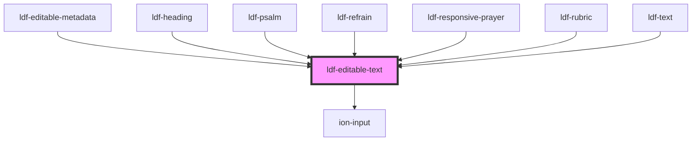

# ldf-editable-text

<!-- Auto Generated Below -->

## Properties

| Property      | Attribute     | Description                                                          | Type                                                                               | Default     |
| ------------- | ------------- | -------------------------------------------------------------------- | ---------------------------------------------------------------------------------- | ----------- |
| `path`        | `path`        | A JSON Pointer that points to the text field being edited            | `string`                                                                           | `undefined` |
| `placeholder` | `placeholder` | Displays if text is falsy or an empty string                         | `string`                                                                           | `undefined` |
| `short`       | `short`       | Whether to display as a short, single-line input                     | `boolean`                                                                          | `undefined` |
| `template`    | `template`    | The base object this expresses as part of `LiturgicalDocument`.value | `(PsalmVerse \| Heading)[] \| BibleReadingVerse \| ResponsivePrayerLine \| string` | `""`        |
| `text`        | `text`        | Starting text for editing                                            | `string`                                                                           | `undefined` |

## Events

| Event                  | Description                                                            | Type                                            |
| ---------------------- | ---------------------------------------------------------------------- | ----------------------------------------------- |
| `ldfAddChildAfter`     | Tells the Editor to add another child after this one in the document   | `CustomEvent<{ path: string; template: any; }>` |
| `ldfCursorMoved`       | Tells the Editor that the cursor has moved within this input           | `CustomEvent<Cursor>`                           |
| `ldfDocShouldChange`   | Tell the Editor that a change has been made to the document            | `CustomEvent<Change>`                           |
| `ldfMergeWithPrevious` | Tells the Editor to merge this node with the previous one in the value | `CustomEvent<{ path: string; value: string; }>` |

## Dependencies

### Used by

 - [ldf-editable-metadata](../editable-metadata)
 - [ldf-heading](../heading)
 - [ldf-psalm](../psalm)
 - [ldf-refrain](../refrain)
 - [ldf-responsive-prayer](../responsive-prayer)
 - [ldf-rubric](../rubric)
 - [ldf-text](../text)

### Depends on

- ion-input

### Graph

----------------------------------------------

*Built with [StencilJS](https://stenciljs.com/)*
