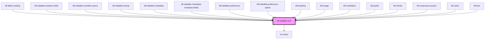

# ldf-editable-text

<!-- Auto Generated Below -->

## Properties

| Property        | Attribute     | Description                                                                      | Type                                                                                            | Default     |
| --------------- | ------------- | -------------------------------------------------------------------------------- | ----------------------------------------------------------------------------------------------- | ----------- |
| `inputType`     | `input-type`  | Type to apply to `<input type=...>`, if `short` is `true`                        | `"date" \| "email" \| "number" \| "password" \| "search" \| "tel" \| "text" \| "time" \| "url"` | `undefined` |
| `path`          | `path`        | A JSON Pointer that points to the text field being edited                        | `string`                                                                                        | `undefined` |
| `placeholder`   | `placeholder` | Displays if text is falsy or an empty string                                     | `string`                                                                                        | `undefined` |
| `short`         | `short`       | Whether to display as a short, single-line input                                 | `boolean`                                                                                       | `undefined` |
| `template`      | `template`    | The base object this expresses as part of `LiturgicalDocument`.value             | `BibleReadingVerse \| Heading \| PsalmVerse \| ResponsivePrayerLine \| string`                  | `""`        |
| `templateMaker` | --            | Function that converts a text node into a `template` — used when a node is split | `(s: string) => string \| ResponsivePrayerLine \| BibleReadingVerse \| PsalmVerse \| Heading`   | `(s) => s`  |
| `text`          | `text`        | Starting text for editing                                                        | `string`                                                                                        | `undefined` |
| `unit`          | `unit`        | Optional unit information (e.g., 'px') to add after the input                    | `string`                                                                                        | `undefined` |

## Events

| Event                  | Description                                                            | Type                                            |
| ---------------------- | ---------------------------------------------------------------------- | ----------------------------------------------- |
| `ldfAddChildAfter`     | Tells the Editor to add another child after this one in the document   | `CustomEvent<{ path: string; template: any; }>` |
| `ldfCursorMoved`       | Tells the Editor that the cursor has moved within this input           | `CustomEvent<Cursor>`                           |
| `ldfDocShouldChange`   | Tell the Editor that a change has been made to the document            | `CustomEvent<Change>`                           |
| `ldfMergeWithPrevious` | Tells the Editor to merge this node with the previous one in the value | `CustomEvent<{ path: string; value: string; }>` |

## Dependencies

### Used by

 - [ldf-bible-reading](../bible-reading)
 - [ldf-editable-antiphon-field](../editable-antiphon-field)
 - [ldf-editable-condition-piece](../editable-condition-piece)
 - [ldf-editable-lookup](../editable-lookup)
 - [ldf-editable-metadata](../editable-metadata)
 - [ldf-editable-metadata-metadata-fields](../editable-metadata-metadata-fields)
 - [ldf-editable-preference](../editable-preference)
 - [ldf-editable-preference-option](../editable-preference-option)
 - [ldf-heading](../heading)
 - [ldf-image](../image)
 - [ldf-meditation](../meditation)
 - [ldf-psalm](../psalm)
 - [ldf-refrain](../refrain)
 - [ldf-responsive-prayer](../responsive-prayer)
 - [ldf-rubric](../rubric)
 - [ldf-text](../text)

### Depends on

- ion-input

### Graph

----------------------------------------------

*Built with [StencilJS](https://stenciljs.com/)*
