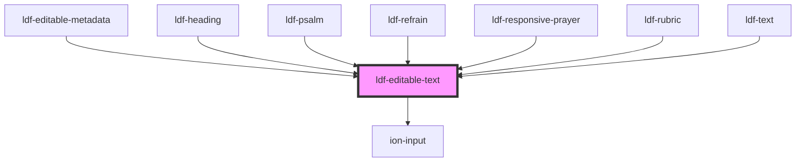

# ldf-editable-text

<!-- Auto Generated Below -->

## Properties

| Property      | Attribute     | Description                                            | Type      | Default     |
| ------------- | ------------- | ------------------------------------------------------ | --------- | ----------- |
| `path`        | `path`        | A JSON Pointer that points to the Collect being edited | `string`  | `undefined` |
| `placeholder` | `placeholder` | Displays if text is falsy or an empty string           | `string`  | `undefined` |
| `short`       | `short`       | Whether to display as a short, single-line input       | `boolean` | `undefined` |
| `text`        | `text`        | Starting text for editing                              | `string`  | `undefined` |

## Events

| Event                | Description | Type                  |
| -------------------- | ----------- | --------------------- |
| `ldfCursorMoved`     |             | `CustomEvent<Cursor>` |
| `ldfDocShouldChange` |             | `CustomEvent<Change>` |

## Methods

### `registerCursor() => Promise<Cursor>`

Sets private cursor field to a Cursor instance and sends it as a `cursor` event

#### Returns

Type: `Promise<Cursor>`

## Dependencies

### Used by

 - [ldf-editable-metadata](../editable-metadata)
 - [ldf-heading](../heading)
 - [ldf-psalm](../psalm)
 - [ldf-refrain](../refrain)
 - [ldf-responsive-prayer](../responsive-prayer)
 - [ldf-rubric](../rubric)
 - [ldf-text](../text)

### Depends on

- ion-input

### Graph

----------------------------------------------

*Built with [StencilJS](https://stenciljs.com/)*
