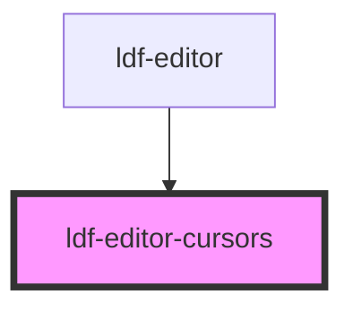

# ldf-editor-cursor

<!-- Auto Generated Below -->

## Properties

| Property  | Attribute | Description                                   | Type                       | Default     |
| --------- | --------- | --------------------------------------------- | -------------------------- | ----------- |
| `cursors` | --        | Cursor positions of active users              | `{ [user: string]: any; }` | `undefined` |
| `parent`  | --        |                                               | `HTMLElement`              | `undefined` |
| `uid`     | `uid`     | Unique ID for the user editing in this editor | `string`                   | `undefined` |
| `users`   | --        | Users currently active in the document        | `{ [uid: string]: any; }`  | `undefined` |

## Dependencies

### Used by

 - [ldf-editor](../editor)

### Graph

----------------------------------------------

*Built with [StencilJS](https://stenciljs.com/)*
