# my-component

<!-- Auto Generated Below -->

## Properties

| Property    | Attribute    | Description | Type     | Default     |
| ----------- | ------------ | ----------- | -------- | ----------- |
| `docId`     | `doc-id`     |             | `string` | `undefined` |
| `userToken` | `user-token` |             | `string` | `undefined` |

## Methods

### `leave(docId: string) => Promise<void>`

#### Returns

Type: `Promise<void>`

## Dependencies

### Depends on

- ion-header
- [ldf-label-bar](../label-bar)
- [ldf-editable-metadata](../editable-metadata)
- [ldf-liturgical-document](../liturgical-document)

### Graph

```mermaid
graph TD;
  ldf-editor --> ion-header
  ldf-editor --> ldf-label-bar
  ldf-editor --> ldf-editable-metadata
  ldf-editor --> ldf-liturgical-document
  ldf-editable-metadata --> ldf-editable-select
  ldf-editable-metadata --> ldf-editable-text
  ldf-editable-select --> ion-select
  ldf-editable-select --> ion-select-option
  ldf-liturgical-document --> ldf-liturgy
  ldf-liturgical-document --> ldf-heading
  ldf-liturgical-document --> ldf-meditation
  ldf-liturgical-document --> ldf-option
  ldf-liturgical-document --> ldf-refrain
  ldf-liturgical-document --> ldf-rubric
  ldf-liturgical-document --> ldf-text
  ldf-liturgical-document --> ldf-responsive-prayer
  ldf-liturgical-document --> ldf-bible-reading
  ldf-liturgical-document --> ldf-psalm
  ldf-liturgy --> ldf-label-bar
  ldf-liturgy --> ldf-editable-delete
  ldf-liturgy --> ldf-liturgical-document
  ldf-liturgy --> ldf-editable-add-block
  ldf-editable-delete --> ion-alert
  ldf-editable-delete --> ion-buttons
  ldf-editable-delete --> ion-button
  ldf-editable-delete --> ion-icon
  ion-alert --> ion-ripple-effect
  ion-alert --> ion-backdrop
  ion-button --> ion-ripple-effect
  ldf-editable-add-block --> ion-modal
  ion-modal --> ion-backdrop
  ldf-heading --> ldf-editable-text
  ldf-heading --> ldf-label-bar
  ldf-meditation --> ion-button
  ldf-meditation --> ion-icon
  ldf-meditation --> ion-label
  ldf-meditation --> ldf-label-bar
  ldf-option --> ion-segment
  ldf-option --> ion-segment-button
  ldf-option --> ion-label
  ldf-option --> ion-select
  ldf-option --> ion-select-option
  ldf-option --> ldf-label-bar
  ldf-option --> ldf-liturgical-document
  ion-segment-button --> ion-ripple-effect
  ldf-refrain --> ldf-label-bar
  ldf-refrain --> ldf-editable-text
  ldf-rubric --> ldf-label-bar
  ldf-rubric --> ldf-editable-text
  ldf-text --> ldf-label-bar
  ldf-text --> ldf-heading
  ldf-text --> ldf-editable-text
  ldf-text --> ldf-string
  ldf-responsive-prayer --> ldf-editable-text
  ldf-responsive-prayer --> ldf-string
  ldf-responsive-prayer --> ldf-label-bar
  ldf-responsive-prayer --> ldf-heading
  ldf-bible-reading --> ldf-label-bar
  ldf-bible-reading --> ldf-string
  ldf-bible-reading --> ldf-heading
  ldf-bible-reading --> ldf-liturgical-document
  ldf-psalm --> ldf-refrain
  ldf-psalm --> ldf-heading
  ldf-psalm --> ldf-label-bar
  ldf-psalm --> ldf-editable-text
  ldf-psalm --> ldf-string
  style ldf-editor fill:#f9f,stroke:#333,stroke-width:4px
```

----------------------------------------------

*Built with [StencilJS](https://stenciljs.com/)*
