# my-component

<!-- Auto Generated Below -->

## Properties

| Property  | Attribute | Description                                                             | Type                           | Default     |
| --------- | --------- | ----------------------------------------------------------------------- | ------------------------------ | ----------- |
| `cursors` | --        | Cursor positions of active users. Drills down to `<ldf-editor-cursors>` | `{ [user: string]: Cursor; }`  | `undefined` |
| `doc`     | `doc`     | An LDF LiturgicalDocument object.                                       | `LiturgicalDocument \| string` | `undefined` |
| `uid`     | `uid`     | Unique ID for the user editing in this editor                           | `string`                       | `undefined` |
| `users`   | --        | Users currently active in the document                                  | `{ [uid: string]: User; }`     | `undefined` |

## Events

| Event                   | Description                                                                                  | Type                                            |
| ----------------------- | -------------------------------------------------------------------------------------------- | ----------------------------------------------- |
| `editorCursorMoved`     | User's cursor/selection changed                                                              | `CustomEvent<Cursor>`                           |
| `editorDocShouldAdd`    | User is requesting we add a new LiturgicalDocument block at JSON pointer path `base`/`index` | `CustomEvent<{ base: string; index: number; }>` |
| `editorDocShouldChange` | User has edited the document                                                                 | `CustomEvent<Change>`                           |

## Dependencies

### Depends on

- [ldf-label-bar](../label-bar)
- [ldf-liturgical-document](../liturgical-document)

### Graph

```mermaid
graph TD;
  ldf-editor --> ldf-label-bar
  ldf-editor --> ldf-liturgical-document
  ldf-liturgical-document --> ldf-liturgy
  ldf-liturgical-document --> ldf-heading
  ldf-liturgical-document --> ldf-meditation
  ldf-liturgical-document --> ldf-option
  ldf-liturgical-document --> ldf-refrain
  ldf-liturgical-document --> ldf-rubric
  ldf-liturgical-document --> ldf-text
  ldf-liturgical-document --> ldf-responsive-prayer
  ldf-liturgical-document --> ldf-bible-reading
  ldf-liturgical-document --> ldf-psalm
  ldf-liturgical-document --> ldf-editable-metadata-buttons
  ldf-liturgy --> ldf-liturgical-document
  ldf-liturgy --> ldf-editable-add-block
  ldf-heading --> ldf-editable-text
  ldf-heading --> ldf-label-bar
  ldf-editable-text --> ion-input
  ldf-meditation --> ion-button
  ldf-meditation --> ion-icon
  ldf-meditation --> ion-label
  ldf-meditation --> ldf-label-bar
  ion-button --> ion-ripple-effect
  ldf-option --> ion-segment
  ldf-option --> ion-segment-button
  ldf-option --> ion-label
  ldf-option --> ion-select
  ldf-option --> ion-select-option
  ldf-option --> ldf-label-bar
  ldf-option --> ldf-liturgical-document
  ion-segment-button --> ion-ripple-effect
  ldf-refrain --> ldf-label-bar
  ldf-refrain --> ldf-editable-text
  ldf-rubric --> ldf-label-bar
  ldf-rubric --> ldf-editable-text
  ldf-text --> ldf-label-bar
  ldf-text --> ldf-heading
  ldf-text --> ldf-editable-text
  ldf-text --> ldf-string
  ldf-responsive-prayer --> ldf-editable-text
  ldf-responsive-prayer --> ldf-string
  ldf-responsive-prayer --> ldf-label-bar
  ldf-responsive-prayer --> ldf-heading
  ldf-bible-reading --> ldf-label-bar
  ldf-bible-reading --> ldf-string
  ldf-bible-reading --> ldf-heading
  ldf-bible-reading --> ldf-liturgical-document
  ldf-psalm --> ldf-refrain
  ldf-psalm --> ldf-heading
  ldf-psalm --> ldf-label-bar
  ldf-psalm --> ldf-editable-text
  ldf-psalm --> ldf-string
  ldf-editable-metadata-buttons --> ldf-label-bar
  ldf-editable-metadata-buttons --> ion-buttons
  ldf-editable-metadata-buttons --> ion-button
  ldf-editable-metadata-buttons --> ion-icon
  ldf-editable-metadata-buttons --> ldf-editable-delete
  ldf-editable-delete --> ion-buttons
  ldf-editable-delete --> ion-button
  ldf-editable-delete --> ion-icon
  style ldf-editor fill:#f9f,stroke:#333,stroke-width:4px
```

----------------------------------------------

*Built with [StencilJS](https://stenciljs.com/)*
