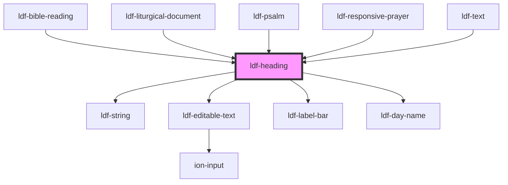

# ldf-heading

<!-- Auto Generated Below -->

## Properties

| Property   | Attribute  | Description                                            | Type      | Default     |
| ---------- | ---------- | ------------------------------------------------------ | --------- | ----------- |
| `doc`      | `doc`      | An LDF Heading object.                                 | `any`     | `undefined` |
| `editable` | `editable` | Whether the object is editable                         | `boolean` | `undefined` |
| `path`     | `path`     | A JSON Pointer that points to the Collect being edited | `string`  | `undefined` |

## Dependencies

### Used by

 - [ldf-bible-reading](../bible-reading)
 - [ldf-liturgical-document](../liturgical-document)
 - [ldf-psalm](../psalm)
 - [ldf-responsive-prayer](../responsive-prayer)
 - [ldf-text](../text)

### Depends on

- [ldf-string](../string)
- [ldf-editable-text](../editable-text)
- [ldf-label-bar](../label-bar)
- [ldf-day-name](../day-name)

### Graph

----------------------------------------------

*Built with [StencilJS](https://stenciljs.com/)*
