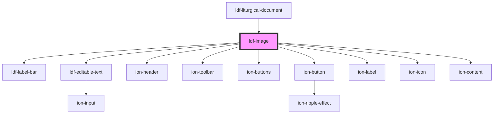

# ldf-image

<!-- Auto Generated Below -->

## Properties

| Property   | Attribute  | Description                                                 | Type              | Default     |
| ---------- | ---------- | ----------------------------------------------------------- | ----------------- | ----------- |
| `doc`      | `doc`      | An LDF Image object.                                        | `Image \| string` | `undefined` |
| `editable` | `editable` | Whether the object is editable                              | `boolean`         | `undefined` |
| `modal`    | `modal`    | If the image is being shown in a modal, pass the modal here | `any`             | `undefined` |
| `path`     | `path`     | A JSON Pointer that points to the Collect being edited      | `string`          | `undefined` |

## Dependencies

### Used by

 - [ldf-liturgical-document](../liturgical-document)

### Depends on

- [ldf-label-bar](../label-bar)
- [ldf-editable-text](../editable-text)
- ion-header
- ion-toolbar
- ion-buttons
- ion-button
- ion-label
- ion-icon
- ion-content

### Graph

----------------------------------------------

*Built with [StencilJS](https://stenciljs.com/)*
