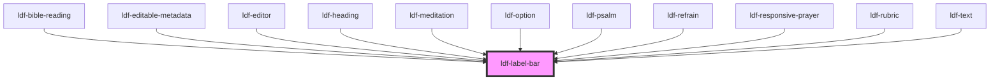

# ldf-label-bar

<!-- Auto Generated Below -->

## Dependencies

### Used by

 - [ldf-bible-reading](../bible-reading)
 - [ldf-editable-metadata](../editable-metadata)
 - [ldf-editor](../editor)
 - [ldf-heading](../heading)
 - [ldf-meditation](../meditation)
 - [ldf-option](../option)
 - [ldf-psalm](../psalm)
 - [ldf-refrain](../refrain)
 - [ldf-responsive-prayer](../responsive-prayer)
 - [ldf-rubric](../rubric)
 - [ldf-text](../text)

### Graph

----------------------------------------------

*Built with [StencilJS](https://stenciljs.com/)*
