# ldf-liturgical-document

<!-- Auto Generated Below -->

## Properties

| Property     | Attribute     | Description                                                             | Type                                                                                                                                             | Default     |
| ------------ | ------------- | ----------------------------------------------------------------------- | ------------------------------------------------------------------------------------------------------------------------------------------------ | ----------- |
| `base`       | `base`        | A JSON Pointer that points to the array within which the item is nested | `string`                                                                                                                                         | `undefined` |
| `doc`        | `doc`         | An LDF LiturgicalDocument object.                                       | `LiturgicalDocument \| string`                                                                                                                   | `undefined` |
| `editable`   | `editable`    | Whether the object is editable                                          | `boolean`                                                                                                                                        | `undefined` |
| `index`      | `index`       | Index within a larger array, if any                                     | `number`                                                                                                                                         | `undefined` |
| `parentType` | `parent-type` | Type of the parent `LiturgicalDocument`, if any                         | `"bible-reading" \| "cycle" \| "heading" \| "liturgy" \| "meditation" \| "option" \| "psalm" \| "refrain" \| "responsive" \| "rubric" \| "text"` | `null`      |
| `path`       | `path`        | A JSON Pointer that points to the LiturgicalDocument being edited       | `string`                                                                                                                                         | `undefined` |

## Events

| Event       | Description | Type                                                      |
| ----------- | ----------- | --------------------------------------------------------- |
| `focusObj`  |             | `CustomEvent<{ obj: LiturgicalDocument; path: string; }>` |
| `focusPath` |             | `CustomEvent<string>`                                     |

## Dependencies

### Used by

 - [ldf-bible-reading](../bible-reading)
 - [ldf-editable-antiphon-field](../editable-antiphon-field)
 - [ldf-editor](../editor)
 - [ldf-liturgy](../liturgy)
 - [ldf-option](../option)
 - [ldf-psalm](../psalm)

### Depends on

- ion-skeleton-text
- [ldf-liturgy](../liturgy)
- [ldf-heading](../heading)
- [ldf-image](../image)
- [ldf-meditation](../meditation)
- [ldf-option](../option)
- [ldf-refrain](../refrain)
- [ldf-rubric](../rubric)
- [ldf-text](../text)
- [ldf-responsive-prayer](../responsive-prayer)
- [ldf-bible-reading](../bible-reading)
- [ldf-psalm](../psalm)
- [ldf-editable-metadata-buttons](../editable-metadata-buttons)

### Graph

```mermaid
graph TD;
  ldf-liturgical-document --> ion-skeleton-text
  ldf-liturgical-document --> ldf-liturgy
  ldf-liturgical-document --> ldf-heading
  ldf-liturgical-document --> ldf-image
  ldf-liturgical-document --> ldf-meditation
  ldf-liturgical-document --> ldf-option
  ldf-liturgical-document --> ldf-refrain
  ldf-liturgical-document --> ldf-rubric
  ldf-liturgical-document --> ldf-text
  ldf-liturgical-document --> ldf-responsive-prayer
  ldf-liturgical-document --> ldf-bible-reading
  ldf-liturgical-document --> ldf-psalm
  ldf-liturgical-document --> ldf-editable-metadata-buttons
  ldf-liturgy --> ldf-liturgical-document
  ldf-editable-add-block --> ion-button
  ldf-editable-add-block --> ion-icon
  ldf-editable-add-block --> ion-label
  ion-button --> ion-ripple-effect
  ldf-heading --> ldf-string
  ldf-heading --> ldf-editable-text
  ldf-heading --> ldf-label-bar
  ldf-heading --> ldf-day-name
  ldf-editable-text --> ion-input
  ldf-image --> ldf-label-bar
  ldf-image --> ldf-editable-text
  ldf-meditation --> ion-button
  ldf-meditation --> ion-icon
  ldf-meditation --> ion-label
  ldf-meditation --> ldf-label-bar
  ldf-option --> ldf-liturgical-document
  ion-segment-button --> ion-ripple-effect
  ldf-refrain --> ldf-label-bar
  ldf-refrain --> ldf-editable-text
  ldf-rubric --> ldf-label-bar
  ldf-rubric --> ldf-editable-text
  ldf-text --> ldf-label-bar
  ldf-text --> ldf-heading
  ldf-text --> ldf-editable-text
  ldf-text --> ldf-string
  ldf-responsive-prayer --> ldf-editable-text
  ldf-responsive-prayer --> ldf-string
  ldf-responsive-prayer --> ldf-label-bar
  ldf-responsive-prayer --> ldf-heading
  ldf-bible-reading --> ldf-liturgical-document
  ldf-psalm --> ldf-liturgical-document
  ldf-editable-metadata-buttons --> ldf-label-bar
  ldf-editable-metadata-buttons --> ion-buttons
  ldf-editable-metadata-buttons --> ion-button
  ldf-editable-metadata-buttons --> ion-icon
  ldf-editable-metadata-buttons --> ldf-editable-delete
  ldf-editable-delete --> ion-buttons
  ldf-editable-delete --> ion-button
  ldf-editable-delete --> ion-icon
  ldf-editable-antiphon-field --> ldf-liturgical-document
  ldf-editor --> ldf-liturgical-document
  style ldf-liturgical-document fill:#f9f,stroke:#333,stroke-width:4px
```

----------------------------------------------

*Built with [StencilJS](https://stenciljs.com/)*
