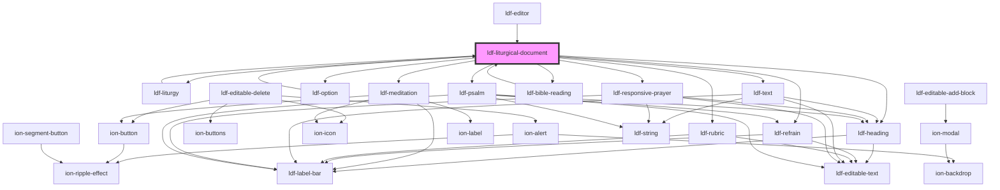

# ldf-liturgical-document

<!-- Auto Generated Below -->

## Properties

| Property   | Attribute  | Description                                                       | Type                           | Default     |
| ---------- | ---------- | ----------------------------------------------------------------- | ------------------------------ | ----------- |
| `doc`      | `doc`      | An LDF LiturgicalDocument object.                                 | `LiturgicalDocument \| string` | `undefined` |
| `editable` | `editable` | Whether the object is editable                                    | `boolean`                      | `undefined` |
| `path`     | `path`     | A JSON Pointer that points to the LiturgicalDocument being edited | `string`                       | `undefined` |

## Events

| Event       | Description | Type                              |
| ----------- | ----------- | --------------------------------- |
| `focusObj`  |             | `CustomEvent<LiturgicalDocument>` |
| `focusPath` |             | `CustomEvent<string>`             |

## Dependencies

### Used by

 - [ldf-bible-reading](../bible-reading)
 - [ldf-editor](../editor)
 - [ldf-liturgy](../liturgy)
 - [ldf-option](../option)

### Depends on

- [ldf-liturgy](../liturgy)
- [ldf-heading](../heading)
- [ldf-meditation](../meditation)
- [ldf-option](../option)
- [ldf-refrain](../refrain)
- [ldf-rubric](../rubric)
- [ldf-text](../text)
- [ldf-responsive-prayer](../responsive-prayer)
- [ldf-bible-reading](../bible-reading)
- [ldf-psalm](../psalm)

### Graph

----------------------------------------------

*Built with [StencilJS](https://stenciljs.com/)*
