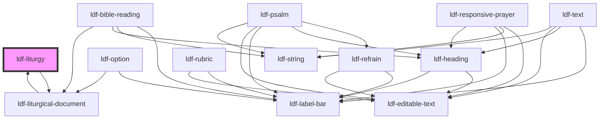

# ldf-liturgy

<!-- Auto Generated Below -->

## Properties

| Property   | Attribute  | Description                                                                | Type                | Default     |
| ---------- | ---------- | -------------------------------------------------------------------------- | ------------------- | ----------- |
| `doc`      | `doc`      | An LDF Liturgy object. If both `doc` and `json` are passed, `doc` is used. | `Liturgy \| string` | `undefined` |
| `editable` | `editable` | Whether the object is editable                                             | `boolean`           | `undefined` |
| `path`     | `path`     | A JSON Pointer that points to the Liturgy being edited                     | `string`            | `undefined` |

## Dependencies

### Used by

 - [ldf-liturgical-document](../liturgical-document)

### Depends on

- [ldf-liturgical-document](../liturgical-document)

### Graph

----------------------------------------------

*Built with [StencilJS](https://stenciljs.com/)*
