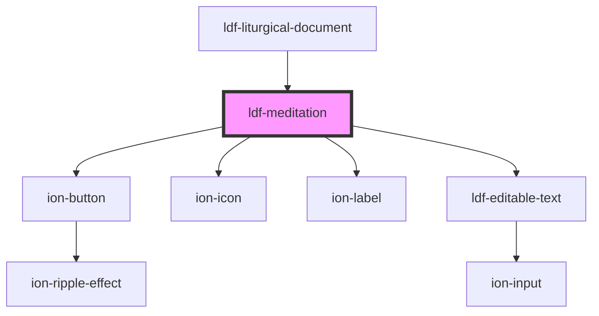

# ldf-meditation

<!-- Auto Generated Below -->

## Properties

| Property    | Attribute   | Description                                               | Type                   | Default     |
| ----------- | ----------- | --------------------------------------------------------- | ---------------------- | ----------- |
| `autostart` | `autostart` | Whether the timer should start playing automatically      | `boolean`              | `undefined` |
| `color`     | `color`     | Liturgical color to use in display                        | `string`               | `"#3333ff"` |
| `doc`       | `doc`       | An LDF Meditation object.                                 | `Meditation \| string` | `undefined` |
| `editable`  | `editable`  | Whether the object is editable                            | `boolean`              | `undefined` |
| `path`      | `path`      | A JSON Pointer that points to the Meditation being edited | `string`               | `undefined` |

## Events

| Event          | Description | Type                                                                              |
| -------------- | ----------- | --------------------------------------------------------------------------------- |
| `timerChanged` |             | `CustomEvent<"complete" \| "pause" \| "resume" \| "rewind" \| "start" \| number>` |

## Methods

### `duration() => Promise<number | undefined>`

Returns the total duration this timer is running for.

#### Returns

Type: `Promise<number>`

### `pause() => Promise<void>`

Pause the timer

#### Returns

Type: `Promise<void>`

### `reset() => Promise<void>`

Reset the selector for length of time

#### Returns

Type: `Promise<void>`

### `resume() => Promise<void>`

Resume the timer

#### Returns

Type: `Promise<void>`

### `rewind() => Promise<void>`

Rewind the timer to its initial value and restart it

#### Returns

Type: `Promise<void>`

### `start(value?: number) => Promise<void>`

Start the timer, either with a given value of seconds or with the number passed in the Meditation object metadata

#### Returns

Type: `Promise<void>`

## Dependencies

### Used by

 - [ldf-liturgical-document](../liturgical-document)

### Depends on

- ion-button
- ion-icon
- ion-label
- [ldf-editable-text](../editable-text)

### Graph

----------------------------------------------

*Built with [StencilJS](https://stenciljs.com/)*
