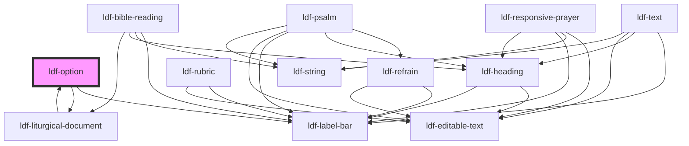

# ldf-option

<!-- Auto Generated Below -->

## Properties

| Property   | Attribute  | Description                                                               | Type               | Default     |
| ---------- | ---------- | ------------------------------------------------------------------------- | ------------------ | ----------- |
| `doc`      | `doc`      | An LDF Option object. If both `doc` and `json` are passed, `doc` is used. | `Option \| string` | `undefined` |
| `editable` | `editable` | Whether the object is editable                                            | `boolean`          | `undefined` |
| `path`     | `path`     | A JSON Pointer that points to the Option being edited                     | `string`           | `undefined` |

## Methods

### `select(index: number) => Promise<void>`

Display the nth option

#### Returns

Type: `Promise<void>`

## Dependencies

### Used by

 - [ldf-liturgical-document](../liturgical-document)

### Depends on

- [ldf-label-bar](../label-bar)
- [ldf-liturgical-document](../liturgical-document)

### Graph

----------------------------------------------

*Built with [StencilJS](https://stenciljs.com/)*
