# ldf-option

<!-- Auto Generated Below -->

## Properties

| Property   | Attribute  | Description                                           | Type               | Default     |
| ---------- | ---------- | ----------------------------------------------------- | ------------------ | ----------- |
| `doc`      | `doc`      | An LDF Option object.                                 | `Option \| string` | `undefined` |
| `editable` | `editable` | Whether the object is editable                        | `boolean`          | `undefined` |
| `path`     | `path`     | A JSON Pointer that points to the Option being edited | `string`           | `undefined` |
| `preview`  | `preview`  | Whether the object is in preview mode                 | `boolean`          | `undefined` |

## Events

| Event                            | Description | Type                                            |
| -------------------------------- | ----------- | ----------------------------------------------- |
| `ldfAddOptionToDoc`              |             | `CustomEvent<AddOptionToDoc>`                   |
| `ldfDocShouldChange`             |             | `CustomEvent<Change>`                           |
| `ldfOptionAskForStoredSelection` |             | `CustomEvent<{ el: HTMLElement; }>`             |
| `ldfOptionMakeSelection`         |             | `CustomEvent<{ slug: string; index: number; }>` |

## Methods

### `select(index: number | 'add', resultedFromUserAction?: boolean) => Promise<void>`

Display the nth option

#### Returns

Type: `Promise<void>`

## Dependencies

### Used by

 - [ldf-liturgical-document](../liturgical-document)

### Depends on

- ion-segment
- ion-segment-button
- ion-label
- ion-toolbar
- ion-select
- ion-select-option
- ion-buttons
- ion-button
- ion-icon
- [ldf-label-bar](../label-bar)
- [ldf-liturgical-document](../liturgical-document)

### Graph

```mermaid
graph TD;
  ldf-option --> ion-segment
  ldf-option --> ion-segment-button
  ldf-option --> ion-label
  ldf-option --> ion-toolbar
  ldf-option --> ion-select
  ldf-option --> ion-select-option
  ldf-option --> ion-buttons
  ldf-option --> ion-button
  ldf-option --> ion-icon
  ldf-option --> ldf-label-bar
  ldf-option --> ldf-liturgical-document
  ion-segment-button --> ion-ripple-effect
  ion-select --> ion-select-popover
  ion-select --> ion-popover
  ion-select --> ion-action-sheet
  ion-select --> ion-alert
  ion-select-popover --> ion-item
  ion-select-popover --> ion-checkbox
  ion-select-popover --> ion-label
  ion-select-popover --> ion-radio-group
  ion-select-popover --> ion-radio
  ion-select-popover --> ion-list
  ion-select-popover --> ion-list-header
  ion-item --> ion-icon
  ion-item --> ion-ripple-effect
  ion-item --> ion-note
  ion-popover --> ion-backdrop
  ion-action-sheet --> ion-backdrop
  ion-action-sheet --> ion-icon
  ion-action-sheet --> ion-ripple-effect
  ion-alert --> ion-ripple-effect
  ion-alert --> ion-backdrop
  ion-button --> ion-ripple-effect
  ldf-liturgical-document --> ldf-option
  ldf-liturgy --> ldf-editable-add-block
  ldf-liturgy --> ldf-liturgical-document
  ldf-editable-add-block --> ion-button
  ldf-editable-add-block --> ion-icon
  ldf-editable-add-block --> ion-label
  ldf-heading --> ldf-string
  ldf-heading --> ldf-editable-text
  ldf-heading --> ldf-label-bar
  ldf-heading --> ldf-day-name
  ldf-heading --> ldf-text
  ldf-editable-text --> ion-input
  ldf-day-name --> ldf-text
  ldf-text --> ldf-label-bar
  ldf-text --> ion-button
  ldf-text --> ldf-heading
  ldf-text --> ldf-editable-text
  ldf-text --> ldf-string
  ldf-image --> ldf-label-bar
  ldf-image --> ldf-editable-text
  ldf-image --> ion-header
  ldf-image --> ion-toolbar
  ldf-image --> ion-buttons
  ldf-image --> ion-button
  ldf-image --> ion-label
  ldf-image --> ion-icon
  ldf-image --> ion-content
  ldf-meditation --> ion-button
  ldf-meditation --> ion-icon
  ldf-meditation --> ion-label
  ldf-meditation --> ldf-editable-text
  ldf-parallel --> ldf-liturgical-document
  ldf-refrain --> ldf-label-bar
  ldf-refrain --> ldf-editable-text
  ldf-rubric --> ldf-label-bar
  ldf-rubric --> ldf-editable-text
  ldf-responsive-prayer --> ldf-editable-text
  ldf-responsive-prayer --> ldf-string
  ldf-responsive-prayer --> ldf-label-bar
  ldf-responsive-prayer --> ldf-heading
  ldf-responsive-prayer --> ldf-editable-boolean
  ldf-editable-boolean --> ion-checkbox
  ldf-bible-reading --> ldf-label-bar
  ldf-bible-reading --> ion-buttons
  ldf-bible-reading --> ion-button
  ldf-bible-reading --> ion-icon
  ldf-bible-reading --> ion-label
  ldf-bible-reading --> ldf-editable-text
  ldf-bible-reading --> ldf-liturgical-document
  ldf-bible-reading --> ldf-heading
  ldf-bible-reading --> ldf-string
  ldf-psalm --> ldf-refrain
  ldf-psalm --> ldf-liturgical-document
  ldf-psalm --> ldf-label-bar
  ldf-psalm --> ldf-editable-text
  ldf-psalm --> ldf-heading
  ldf-psalm --> ion-buttons
  ldf-psalm --> ion-button
  ldf-psalm --> ion-icon
  ldf-psalm --> ion-label
  ldf-psalm --> ldf-string
  ldf-editable-metadata-buttons --> ion-buttons
  ldf-editable-metadata-buttons --> ion-button
  ldf-editable-metadata-buttons --> ion-label
  ldf-editable-metadata-buttons --> ion-icon
  ldf-editable-metadata-buttons --> ldf-editable-select
  ldf-editable-metadata-buttons --> ldf-editable-delete
  ldf-editable-select --> ion-select
  ldf-editable-select --> ion-select-option
  ldf-editable-delete --> ion-buttons
  ldf-editable-delete --> ion-button
  ldf-editable-delete --> ion-icon
  ion-chip --> ion-ripple-effect
  style ldf-option fill:#f9f,stroke:#333,stroke-width:4px
```

----------------------------------------------

*Built with [StencilJS](https://stenciljs.com/)*
