# ldf-option

<!-- Auto Generated Below -->

## Properties

| Property   | Attribute  | Description                                           | Type               | Default     |
| ---------- | ---------- | ----------------------------------------------------- | ------------------ | ----------- |
| `doc`      | `doc`      | An LDF Option object.                                 | `Option \| string` | `undefined` |
| `editable` | `editable` | Whether the object is editable                        | `boolean`          | `undefined` |
| `path`     | `path`     | A JSON Pointer that points to the Option being edited | `string`           | `undefined` |

## Events

| Event               | Description | Type                          |
| ------------------- | ----------- | ----------------------------- |
| `ldfAddOptionToDoc` |             | `CustomEvent<AddOptionToDoc>` |

## Methods

### `select(index: number | "add") => Promise<void>`

Display the nth option

#### Returns

Type: `Promise<void>`

## Dependencies

### Used by

 - [ldf-liturgical-document](../liturgical-document)

### Depends on

- ion-segment
- ion-segment-button
- ion-label
- ion-toolbar
- ion-select
- ion-select-option
- ion-buttons
- ion-button
- ion-icon
- [ldf-label-bar](../label-bar)
- [ldf-liturgical-document](../liturgical-document)

### Graph

```mermaid
graph TD;
  ldf-option --> ion-segment
  ldf-option --> ion-segment-button
  ldf-option --> ion-label
  ldf-option --> ion-toolbar
  ldf-option --> ion-select
  ldf-option --> ion-select-option
  ldf-option --> ion-buttons
  ldf-option --> ion-button
  ldf-option --> ion-icon
  ldf-option --> ldf-label-bar
  ldf-option --> ldf-liturgical-document
  ion-segment-button --> ion-ripple-effect
  ion-button --> ion-ripple-effect
  ldf-liturgical-document --> ldf-option
  ldf-liturgy --> ldf-liturgical-document
  ldf-liturgy --> ldf-editable-add-block
  ldf-heading --> ldf-editable-text
  ldf-heading --> ldf-label-bar
  ldf-editable-text --> ion-input
  ldf-meditation --> ion-button
  ldf-meditation --> ion-icon
  ldf-meditation --> ion-label
  ldf-meditation --> ldf-label-bar
  ldf-refrain --> ldf-label-bar
  ldf-refrain --> ldf-editable-text
  ldf-rubric --> ldf-label-bar
  ldf-rubric --> ldf-editable-text
  ldf-text --> ldf-label-bar
  ldf-text --> ldf-heading
  ldf-text --> ldf-editable-text
  ldf-text --> ldf-string
  ldf-responsive-prayer --> ldf-editable-text
  ldf-responsive-prayer --> ldf-string
  ldf-responsive-prayer --> ldf-label-bar
  ldf-responsive-prayer --> ldf-heading
  ldf-bible-reading --> ldf-label-bar
  ldf-bible-reading --> ldf-string
  ldf-bible-reading --> ldf-heading
  ldf-bible-reading --> ldf-liturgical-document
  ldf-psalm --> ldf-refrain
  ldf-psalm --> ldf-heading
  ldf-psalm --> ldf-label-bar
  ldf-psalm --> ldf-editable-text
  ldf-psalm --> ldf-string
  ldf-editable-metadata-buttons --> ldf-label-bar
  ldf-editable-metadata-buttons --> ion-buttons
  ldf-editable-metadata-buttons --> ion-button
  ldf-editable-metadata-buttons --> ion-icon
  ldf-editable-metadata-buttons --> ldf-editable-delete
  ldf-editable-delete --> ion-buttons
  ldf-editable-delete --> ion-button
  ldf-editable-delete --> ion-icon
  style ldf-option fill:#f9f,stroke:#333,stroke-width:4px
```

----------------------------------------------

*Built with [StencilJS](https://stenciljs.com/)*
