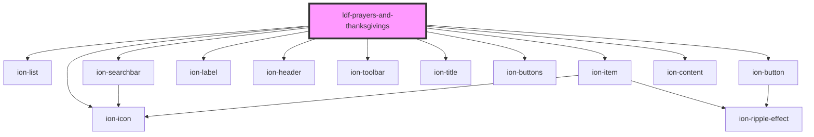

# ldf-prayers-and-thanksgivings

<!-- Auto Generated Below -->

## Properties

| Property  | Attribute | Description                                                                      | Type     | Default     |
| --------- | --------- | -------------------------------------------------------------------------------- | -------- | ----------- |
| `base`    | `base`    | A JSON Pointer that points to the list into which we should insert a prayer      | `string` | `undefined` |
| `index`   | `index`   | A JSON Pointer that points to the index before which we should insert the prayer | `string` | `undefined` |
| `modal`   | `modal`   |                                                                                  | `any`    | `undefined` |
| `options` | --        |                                                                                  | `Text[]` | `undefined` |
| `parent`  | `parent`  |                                                                                  | `any`    | `undefined` |

## Events

| Event                              | Description                                           | Type                   |
| ---------------------------------- | ----------------------------------------------------- | ---------------------- |
| `ldfAskForPrayersAndThanksgivings` | Requests a list of possible Prayers and Thanksgivings | `CustomEvent<boolean>` |

## Methods

### `setOptions(options: Text[]) => Promise<void>`

Set the list of available prayers

#### Returns

Type: `Promise<void>`

## Dependencies

### Depends on

- ion-list
- ion-searchbar
- ion-item
- ion-label
- ion-header
- ion-toolbar
- ion-title
- ion-buttons
- ion-button
- ion-icon
- ion-content

### Graph

----------------------------------------------

*Built with [StencilJS](https://stenciljs.com/)*
