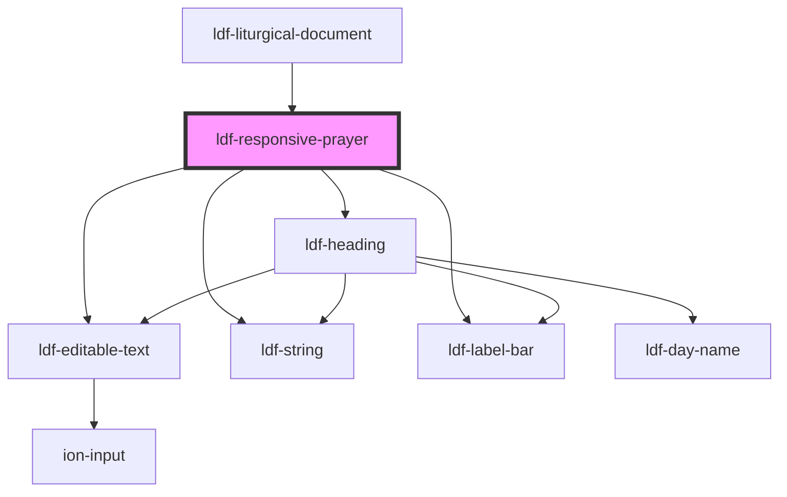

# ldf-responsive-prayer

<!-- Auto Generated Below -->

## Properties

| Property   | Attribute  | Description                                                     | Type      | Default     |
| ---------- | ---------- | --------------------------------------------------------------- | --------- | ----------- |
| `doc`      | `doc`      | An LDF ResponsivePrayer object.                                 | `any`     | `undefined` |
| `editable` | `editable` | Whether the object is editable                                  | `boolean` | `undefined` |
| `path`     | `path`     | A JSON Pointer that points to the ResponsivePrayer being edited | `string`  | `undefined` |

## Dependencies

### Used by

 - [ldf-liturgical-document](../liturgical-document)

### Depends on

- [ldf-editable-text](../editable-text)
- [ldf-string](../string)
- [ldf-label-bar](../label-bar)
- [ldf-heading](../heading)

### Graph

----------------------------------------------

*Built with [StencilJS](https://stenciljs.com/)*
