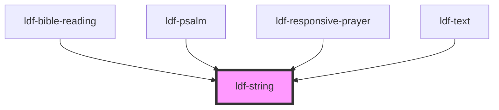

# ldf-string

<!-- Auto Generated Below -->

## Properties

| Property                | Attribute                | Description                                                        | Type                                 | Default     |
| ----------------------- | ------------------------ | ------------------------------------------------------------------ | ------------------------------------ | ----------- |
| `citation`              | --                       | Citation (used in Share and Favorite APIs)                         | `SelectableCitation`                 | `undefined` |
| `dropcap`               | `dropcap`                | Enable, disable, or force dropcap on the first letter of the text. | `"disabled" \| "enabled" \| "force"` | `'enabled'` |
| `dropcapMinLength`      | `dropcap-min-length`     | Minimum length (in characters) a string must be to have a dropcap. | `number`                             | `200`       |
| `index`                 | `index`                  | String's index within its parent.                                  | `number`                             | `undefined` |
| `replaceTetragrammaton` | `replace-tetragrammaton` | Enable or disable replacement of tetragrammaton.                   | `boolean`                            | `true`      |
| `text`                  | `text`                   | The text to be processed.                                          | `string`                             | `undefined` |

## Dependencies

### Used by

 - [ldf-bible-reading](../bible-reading)
 - [ldf-psalm](../psalm)
 - [ldf-responsive-prayer](../responsive-prayer)
 - [ldf-text](../text)

### Graph

----------------------------------------------

*Built with [StencilJS](https://stenciljs.com/)*
