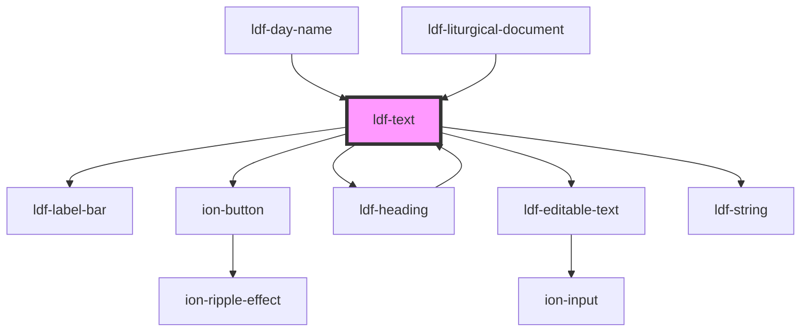

# ldf-collect

<!-- Auto Generated Below -->

## Properties

| Property   | Attribute  | Description                                         | Type             | Default     |
| ---------- | ---------- | --------------------------------------------------- | ---------------- | ----------- |
| `doc`      | `doc`      | An LDF Text object.                                 | `Text \| string` | `undefined` |
| `editable` | `editable` | Whether the object is editable                      | `boolean`        | `undefined` |
| `path`     | `path`     | A JSON Pointer that points to the Text being edited | `string`         | `undefined` |

## Events

| Event                | Description                           | Type                  |
| -------------------- | ------------------------------------- | --------------------- |
| `ldfDocShouldChange` | Used to add Prayers and Thanksgivings | `CustomEvent<Change>` |

## Dependencies

### Used by

 - [ldf-day-name](../day-name)
 - [ldf-heading](../heading)
 - [ldf-liturgical-document](../liturgical-document)

### Depends on

- [ldf-label-bar](../label-bar)
- ion-button
- [ldf-heading](../heading)
- [ldf-editable-text](../editable-text)
- [ldf-string](../string)

### Graph

----------------------------------------------

*Built with [StencilJS](https://stenciljs.com/)*
